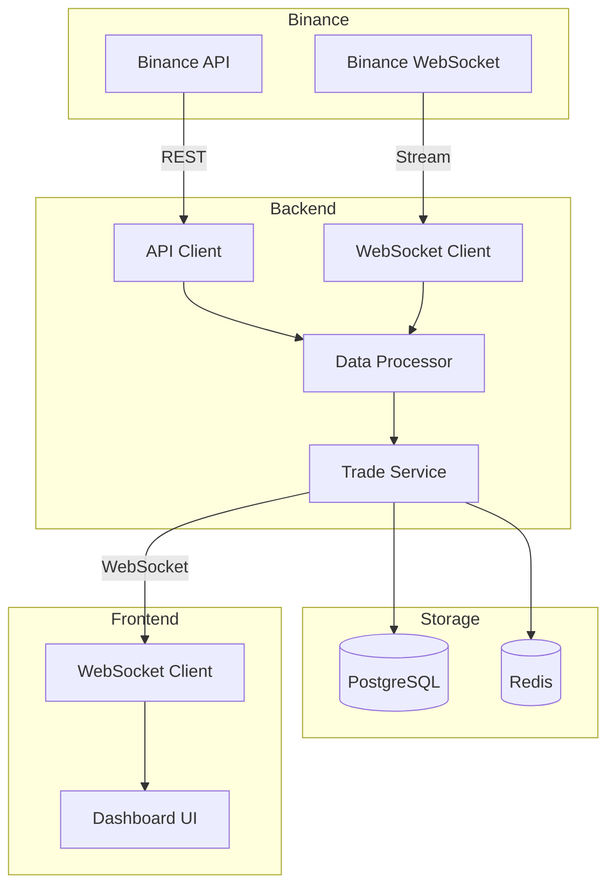

# PRD: Binance 실시간 데이터 연동 시스템

## 📋 개요

### 제품명
Binance 실시간 데이터 연동 시스템

### 목적
Binance 거래소의 실시간 시장 데이터를 수집하고 처리하여 트레이딩 저널 시스템에 통합

### 타겟 사용자
- 암호화폐 트레이더
- 자동매매 시스템 사용자
- 포트폴리오 관리자

---

## 🎯 비즈니스 목표

### 핵심 목표
1. **실시간 데이터 수집**: Binance API를 통한 실시간 가격 데이터 수집
2. **거래 자동 기록**: 사용자의 실제 거래 내역 자동 동기화
3. **성과 분석 자동화**: 실시간 PnL 계산 및 분석

### 성공 지표
- API 응답 시간 < 200ms
- WebSocket 연결 안정성 99.9%
- 초당 처리 가능 메시지 > 1000개
- 데이터 정확도 100%

---

## 🔧 기능 요구사항

### 필수 기능 (P0)

#### 1. Binance REST API 연동
- **인증**: API Key/Secret 관리 시스템
- **계정 정보**: 잔고, 포지션 조회
- **거래 내역**: 과거 거래 데이터 가져오기
- **주문 관리**: 주문 생성/수정/취소

#### 2. Binance WebSocket 연동
- **실시간 가격**: 틱 데이터 스트리밍
- **호가창**: 실시간 오더북 데이터
- **거래 스트림**: 실시간 거래 체결 정보
- **사용자 데이터**: 계정 업데이트 스트림

#### 3. 데이터 저장 및 처리
- **데이터베이스 저장**: PostgreSQL 실시간 저장
- **캐싱**: Redis를 통한 최신 데이터 캐싱
- **배치 처리**: 대량 데이터 효율적 처리

### 선택 기능 (P1)

#### 1. 다중 심볼 지원
- 동시에 여러 암호화폐 페어 모니터링
- 사용자별 관심 심볼 관리

#### 2. 알림 시스템
- 가격 변동 알림
- 거래 체결 알림
- 시스템 상태 알림

#### 3. 데이터 분석
- 기술적 지표 계산
- 거래 패턴 분석
- 성과 메트릭 자동 생성

---

## 💻 기술 요구사항

### 백엔드 아키텍처

#### Spring Boot 컴포넌트
```java
- BinanceApiClient: REST API 클라이언트
- BinanceWebSocketClient: WebSocket 연결 관리
- DataProcessor: 실시간 데이터 처리
- TradeService: 거래 로직 처리
- CacheManager: Redis 캐시 관리
```

#### 데이터 모델
```sql
-- 실시간 가격 데이터
CREATE TABLE price_ticks (
    id BIGSERIAL PRIMARY KEY,
    symbol VARCHAR(20),
    price DECIMAL(20,8),
    volume DECIMAL(20,8),
    timestamp TIMESTAMP
);

-- 사용자 거래
CREATE TABLE user_trades (
    id BIGSERIAL PRIMARY KEY,
    user_id BIGINT,
    order_id VARCHAR(100),
    symbol VARCHAR(20),
    side VARCHAR(10),
    price DECIMAL(20,8),
    quantity DECIMAL(20,8),
    commission DECIMAL(20,8),
    timestamp TIMESTAMP
);
```

### 프론트엔드 요구사항

#### 실시간 대시보드
- 실시간 차트 (TradingView 위젯)
- 포트폴리오 현황
- 거래 내역 테이블
- 수익률 그래프

#### WebSocket 연결
- Socket.io 또는 native WebSocket
- 자동 재연결 로직
- 연결 상태 표시

### 보안 요구사항

#### API 키 관리
- 암호화된 저장 (AES-256)
- 환경 변수 분리
- 키 순환 정책

#### 접근 제어
- IP 화이트리스트
- Rate Limiting
- 요청 서명 검증

---

## 📐 시스템 아키텍처



---

## 🚀 구현 계획

### Phase 1: 기반 구축 (Week 1-2)
1. Binance API 클라이언트 구현
2. 인증 시스템 구축
3. 기본 데이터 모델 설계

### Phase 2: 실시간 연동 (Week 3-4)
1. WebSocket 연결 구현
2. 실시간 데이터 처리 파이프라인
3. Redis 캐싱 구현

### Phase 3: 프론트엔드 통합 (Week 5-6)
1. 실시간 대시보드 개발
2. WebSocket 연결 구현
3. 차트 및 시각화

### Phase 4: 고도화 (Week 7-8)
1. 성능 최적화
2. 에러 처리 강화
3. 모니터링 시스템

---

## ⚠️ 리스크 및 대응

### 기술적 리스크
| 리스크 | 영향도 | 대응 방안 |
|--------|--------|-----------|
| API Rate Limit | 높음 | 요청 큐잉, 캐싱 전략 |
| WebSocket 끊김 | 높음 | 자동 재연결, 백업 연결 |
| 데이터 불일치 | 중간 | 트랜잭션, 검증 로직 |
| 성능 병목 | 중간 | 비동기 처리, 스케일링 |

### 보안 리스크
| 리스크 | 영향도 | 대응 방안 |
|--------|--------|-----------|
| API 키 노출 | 치명적 | 암호화, 접근 제어 |
| DDoS 공격 | 높음 | Rate Limiting, WAF |
| 데이터 탈취 | 높음 | SSL/TLS, 암호화 |

---

## 📊 성과 측정

### KPI
- **가용성**: 시스템 업타임 > 99.9%
- **성능**: P95 레이턴시 < 100ms
- **정확성**: 데이터 정확도 100%
- **확장성**: 동시 접속 > 1000명

### 모니터링
- Prometheus + Grafana
- 애플리케이션 로그 (ELK Stack)
- 비즈니스 메트릭 대시보드

---

## 📝 참고사항

### API 문서
- [Binance API Documentation](https://binance-docs.github.io/apidocs/)
- [WebSocket Streams](https://github.com/binance/binance-spot-api-docs/blob/master/web-socket-streams.md)

### 제약사항
- Binance API Rate Limits 준수
- GDPR 및 개인정보보호법 준수
- 거래소 이용약관 준수

### 의존성
- Spring Boot 3.5.4+
- PostgreSQL 15+
- Redis 7.0+
- Next.js 15+

---

## ✅ 승인 기준

### 기능 완료
- [ ] REST API 연동 완료
- [ ] WebSocket 실시간 연동
- [ ] 데이터 저장 파이프라인
- [ ] 프론트엔드 대시보드

### 품질 기준
- [ ] 단위 테스트 커버리지 > 80%
- [ ] 통합 테스트 통과
- [ ] 성능 테스트 통과
- [ ] 보안 검증 완료

### 문서화
- [ ] API 문서 작성
- [ ] 사용자 가이드
- [ ] 운영 매뉴얼
- [ ] 트러블슈팅 가이드