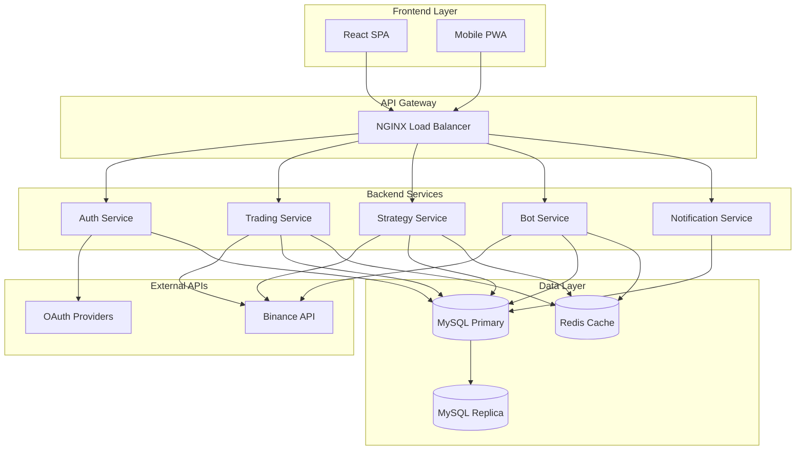

# CryptoTradeManager PRD 

## 1. 개요

### 1.1 프로젝트 정보
- **프로젝트명**: CryptoTradeManager
- **버전**: v1.0
- **문서 작성일**: 2025-08-07
- **작성자**: Development Team

### 1.2 프로젝트 목적
Binance API를 연동하여 사용자의 암호화폐 거래 내역을 자동으로 수집하고, AI 기반 분석을 통해 매매 성과를 평가하며, 전략 기반 자동매매를 제공하는 통합 플랫폼 구축

### 1.3 비즈니스 목표
- **주요 목표**: 암호화폐 트레이더의 거래 분석 및 성과 관리 효율성 향상
- **부가 목표**: AI 기반 매매 피드백을 통한 트레이딩 스킬 개선 지원
- **확장 목표**: 자동매매를 통한 24/7 거래 기회 활용 및 체계적인 리스크  

## 2. 시스템 아키텍처

### 2.1 기술 스택
```yaml
Backend:
  Framework: Spring Boot 3.2+
  Language: Java 17
  Database: MySQL 8.0
  Cache: Redis 7.0
  Security: Spring Security 6.0
  
Frontend:
  Framework: React 18
  Language: TypeScript 4.9+
  UI Library: Material-UI v5
  Charts: Chart.js, TradingView Lightweight Charts
  State Management: Redux Toolkit
  
Infrastructure:
  Containerization: Docker & Docker Compose
  CI/CD: GitHub Actions
  Cloud: AWS (EC2, RDS, ElastiCache)
  Monitoring: Prometheus, Grafana
  
External APIs:
  Exchange: Binance REST API v3, WebSocket
  Authentication: Google OAuth 2.0, Apple Sign-In
```

### 2.2 시스템 구성도


## 3. 기능 요구사항 (상세화)

### 3.1 사용자 관리 시스템

#### 3.1.1 회원가입/로그인 시스템
**기능 상세**:
```yaml
회원가입:
  필수항목: [이메일, 비밀번호, 닉네임, 약관동의]
  선택항목: [프로필이미지, 휴대폰번호]
  검증규칙:
    이메일: RFC 5322 표준, 중복 검증
    비밀번호: 최소 8자, 대소문자+숫자+특수문자
    닉네임: 2-20자, 한글/영문/숫자 허용
  
로그인:
  방식: [이메일+비밀번호, 소셜로그인, 2FA]
  보안: 로그인 시도 제한 (5회/10분)
  세션: JWT 토큰 (Access: 1시간, Refresh: 2주)
```

**API 엔드포인트**:
```yaml
POST /api/v1/auth/register:
  request:
    email: string (required)
    password: string (required)  
    nickname: string (required)
    terms_agreed: boolean (required)
  response:
    user_id: string
    verification_token: string

POST /api/v1/auth/login:
  request:
    email: string
    password: string
    remember_me: boolean
  response:
    access_token: string
    refresh_token: string
    user: UserProfile
```

#### 3.1.2 사용자 프로필 관리
**기능 확장**:
- 프로필 이미지 업로드 (최대 2MB, JPG/PNG)
- 계정 설정: 언어(한글/영어), 시간대, 통화단위
- 보안 설정: 2FA 활성화, 로그인 알림
- 개인정보 수정 이력 관리

### 3.2 거래소 연동 시스템

#### 3.2.1 Binance API 연동 고도화
**API 키 관리**:
```yaml
저장방식: 
  암호화: AES-256-GCM
  키관리: AWS KMS 또는 HashiCorp Vault
  접근제어: 사용자별 격리, 암복호화 로그

권한검증:
  필수권한: [SPOT 거래, 계정조회]
  선택권한: [FUTURES 거래, MARGIN 거래]
  제한사항: 출금권한 비활성화 권장

모니터링:
  연결상태: 실시간 헬스체크 (30초 간격)
  API제한: Rate Limit 모니터링 및 조절
  오류처리: 지수백오프 재시도 정책
```

#### 3.2.2 데이터 수집 시스템 강화
**실시간 데이터 수집**:
```yaml
WebSocket연결:
  endpoint: wss://stream.binance.com:9443/ws
  구독채널: [개별가격스트림, 거래체결스트림]
  연결관리: 자동재연결, 하트비트 체크
  
스케줄링:
  거래내역: 매 5분마다 동기화
  계좌정보: 매 10분마다 업데이트  
  포지션정보: 매 1분마다 확인
  
중복방지:
  Primary Key: exchange_order_id
  Upsert 패턴 사용
  타임스탬프 기반 검증
```

### 3.3 매매일지 관리 시스템

#### 3.3.1 거래 내역 관리 고도화
**CRUD 기능 확장**:
```yaml
조회기능:
  필터링: [날짜범위, 코인종류, 거래유형, 수익구간]
  정렬: [시간순, 수익률순, 거래량순]
  페이징: 기본 20개/페이지, 최대 100개/페이지
  검색: 코인명, 태그, 메모 통합검색
  
데이터표시:
  기본정보: [시간, 코인, 타입, 수량, 가격, 수수료]
  계산정보: [실현손익, 수익률, 누적수익]
  부가정보: [태그, 메모, 전략명]
```

#### 3.3.2 손익 계산 시스템 정교화
**계산 로직**:
```yaml
실현손익:
  공식: (판매가격 - 구매가격) × 수량 - 총수수료
  다중거래: FIFO 방식 적용
  수수료포함: Maker/Taker 수수료 구분
  
미실현손익:
  공식: (현재가 - 평균단가) × 보유수량
  업데이트: 실시간 가격 연동
  
통계지표:
  승률: 수익거래 / 전체거래 × 100
  손익비: 평균수익 / 평균손실
  샤프비율: (수익률 - 무위험수익률) / 변동성
  MDD: 최대낙폭 = (고점 - 저점) / 고점 × 100
```

### 3.4 AI 분석 시스템

#### 3.4.1 매매 성과 점수화 알고리즘
**점수 계산 공식**:
```yaml
종합점수 = Σ(지표 × 가중치)

지표별 가중치:
  승률점수 (40%): 승률 기반 0-100점
  손익비점수 (30%): Risk-Reward Ratio 기반
  리스크관리점수 (20%): MDD, 포지션사이징 기반  
  일관성점수 (10%): 수익 변동성 기반

등급기준:
  S등급: 90-100점 (상위 5%)
  A등급: 80-89점 (상위 15%)  
  B등급: 70-79점 (상위 30%)
  C등급: 60-69점 (상위 50%)
  D등급: 60점 미만
```

#### 3.4.2 AI 피드백 생성 시스템
**피드백 로직**:
```yaml
분석항목:
  거래패턴: 거래빈도, 보유기간, 진입/청산 타이밍
  리스크관리: 손절점 설정, 포지션 크기, 분산투자
  심리적요인: 연속손실 후 행동, 큰 수익 후 행동
  
피드백유형:
  IMPROVEMENT: 승률 < 50% 또는 손익비 < 1.0
  WARNING: MDD > 20% 또는 연속손실 > 5회
  PRAISE: 목표 달성 또는 일관된 수익

템플릿예시:
  "최근 승률이 35%로 낮습니다. 진입 조건을 더 엄격하게 설정하고, 
   기술적 분석을 통한 지지저항선 확인을 권장합니다."
```

### 3.5 전략 관리 시스템

#### 3.5.1 기본 전략 구현
**기술적 지표 전략**:
```yaml
RSI전략:
  매개변수: RSI기간(14), 과매수구간(70), 과매도구간(30)
  로직: RSI < 30 매수, RSI > 70 매도
  추가조건: 거래량 증가 확인, 지지저항선 고려
  
이동평균전략:
  매개변수: 단기MA(5), 장기MA(20)
  로직: 골든크로스 매수, 데드크로스 매도
  추가조건: 추세확인, 거짓신호 필터링
  
MACD전략:
  매개변수: 빠른EMA(12), 느린EMA(26), 신호선(9)
  로직: MACD > Signal 매수, MACD < Signal 매도
  추가조건: 히스토그램 확인, 다이버전스 체크
```

#### 3.5.2 백테스트 엔진
**백테스트 상세 사양**:
```yaml
데이터범위: 최대 2년, 최소 3개월
거래수수료: Binance 실제 수수료 적용
슬리피지: 0.05% 기본값 (거래량 기반 조정)
초기자본: 사용자 설정 가능 (기본 10,000 USDT)

성과지표:
  총수익률: (최종자본 - 초기자본) / 초기자본
  연환산수익률: 총수익률 × (365 / 백테스트일수)
  최대낙폭: 기간 중 최대 손실폭
  승률: 수익거래 비율
  샤프비율: 위험대비 수익 효율성
  
검증기능:
  과최적화검증: Walk-Forward Analysis
  강건성테스트: 매개변수 민감도 분석
  몬테카를로: 시나리오별 수익률 분포
```

### 3.6 자동매매 시스템

#### 3.6.1 매매 엔진 고도화
**주문 실행 시스템**:
```yaml
주문유형:
  시장가: 즉시체결, 슬리피지 고려
  지정가: 원하는 가격 설정
  조건부주문: Stop Loss, Take Profit
  고급주문: OCO, 아이스버그, 트레일링
  
리스크관리:
  포지션크기: Kelly Criterion 또는 고정%
  최대손실: 일일/월간 손실한도 설정
  상관관계: 동일 섹터 중복투자 제한
  
실행최적화:
  지연최소화: 전용 WebSocket 연결
  오류처리: 즉시 재시도 및 알림
  로깅: 모든 주문 상세 기록
```

#### 3.6.2 봇 제어 시스템
**봇 관리 확장**:
```yaml
상태관리:
  STOPPED: 완전 정지
  RUNNING: 정상 동작
  PAUSED: 일시 정지
  ERROR: 오류 상태
  MAINTENANCE: 유지보수 모드
  
모니터링:
  실시간지표: 수익률, 포지션, 위험도
  성과추적: 일/주/월 성과 비교
  알림설정: Slack, 이메일, 푸시 알림
  
다중봇지원:
  전략별분리: 각 전략당 독립적 봇
  자원할당: CPU/메모리 사용량 제한
  우선순위: 중요도에 따른 실행순서
```

### 3.7 대시보드 시스템

#### 3.7.1 실시간 현황 대시보드
**위젯 구성**:
```yaml
포트폴리오위젯:
  - 총자산가치 (USDT, KRW)
  - 일간 수익률 (+/-%)
  - 보유 코인 분포 (파이차트)
  - 상위 5개 보유종목
  
성과위젯:
  - 실현손익 (일/주/월/전체)
  - 승률 및 손익비
  - 최대낙폭 (MDD)
  - 활성 봇 현황
  
시장정보위젯:
  - 관심종목 가격
  - 시장 지배력 (비트코인 도미넌스)
  - 공포탐욕지수
  - 주요 뉴스 피드
```

#### 3.7.2 알림 시스템
**알림 확장**:
```yaml
거래알림:
  - 주문 체결/취소
  - 목표 수익률 달성
  - 손절매 실행
  - 봇 상태 변경
  
시장알림:
  - 급격한 가격 변동 (±5% 이상)
  - 거래량 급증
  - 기술적 신호 발생
  - 뉴스 키워드 알림
  
시스템알림:
  - API 연결 오류
  - 서버 성능 이상
  - 보안 이벤트
  - 정기점검 안내

알림채널:
  - 인앱 푸시
  - 이메일
  - SMS (선택사항)
  - Slack/Discord 웹훅
```

## 4. 비기능적 요구사항 (정량화)

### 4.1 성능 요구사항
```yaml
응답시간:
  API응답: 평균 < 200ms, 최대 < 2초
  DB쿼리: 평균 < 100ms, 복합쿼리 < 500ms
  실시간데이터: 지연 < 50ms
  페이지로딩: 초기 < 3초, 후속 < 1초

처리량:
  동시사용자: 1,000명 (목표), 5,000명 (확장)
  API호출: 1,000 TPS
  WebSocket연결: 10,000개 동시연결
  데이터동기화: 전체계정 30분 내 완료

확장성:
  수평확장: 3-5대 서버 클러스터
  데이터증가: 연간 10TB 수용 가능
  사용자증가: 10배 확장 가능한 설계
```

### 4.2 보안 요구사항
```yaml
데이터보호:
  전송암호화: TLS 1.3
  저장암호화: AES-256-GCM
  키관리: 별도 KMS 또는 HSM
  개인정보: GDPR, 개인정보보호법 준수

접근제어:
  인증: JWT (HS256) + Refresh Token
  인가: RBAC (Role-Based Access Control)
  세션: 자동만료, 동시로그인 제한
  API보안: Rate Limiting, CORS 설정

감사및모니터링:
  로깅: 모든 민감한 작업 로그
  모니터링: 실시간 보안이벤트 감지
  백업: 일일 암호화 백업
  사고대응: 24시간 내 대응체계
```

### 4.3 가용성 요구사항
```yaml
서비스가용성:
  목표: 99.5% (월 3.6시간 다운타임 허용)
  측정: 외부 모니터링 도구 활용
  SLA: 99.0% 최소 보장

장애복구:
  RTO (복구목표시간): 2시간
  RPO (복구목표시점): 15분
  백업주기: 실시간 복제 + 일일 스냅샷
  재해복구: 별도 리전 백업

유지보수:
  정기점검: 월 1회 새벽시간대
  긴급패치: 24시간 이내 배포
  업데이트: 무중단 배포 (Blue-Green)
```

## 5. API 명세 (구체화)

### 5.1 RESTful API 상세 설계

#### 인증 관련 API
```yaml
POST /api/v1/auth/register:
  description: 신규 사용자 회원가입
  request:
    content-type: application/json
    body:
      email: string (email format, required)
      password: string (min 8 chars, required)
      nickname: string (2-20 chars, required)
      terms_agreed: boolean (required)
      marketing_agreed: boolean (optional)
  response:
    success:
      status: 201
      body:
        user_id: string
        email: string
        nickname: string
        email_verified: boolean
        created_at: datetime
    error:
      400: Validation error
      409: Email already exists

POST /api/v1/auth/login:
  description: 사용자 로그인
  request:
    body:
      email: string (required)
      password: string (required)
      remember_me: boolean (default: false)
  response:
    success:
      status: 200
      body:
        access_token: string (JWT, 1 hour)
        refresh_token: string (2 weeks)
        user:
          id: string
          email: string
          nickname: string
          profile_image: string|null
          last_login: datetime
    error:
      401: Invalid credentials
      423: Account locked
```

#### 거래 관련 API
```yaml
GET /api/v1/trades:
  description: 거래 내역 조회
  parameters:
    query:
      page: integer (default: 1)
      size: integer (default: 20, max: 100)
      symbol: string (optional, e.g., "BTCUSDT")
      type: enum [BUY, SELL] (optional)
      start_date: datetime (optional)
      end_date: datetime (optional)
      min_profit: number (optional)
      max_profit: number (optional)
  response:
    success:
      status: 200
      body:
        data:
          - id: string
            symbol: string
            type: enum [BUY, SELL]
            quantity: number
            price: number
            fee: number
            realized_pnl: number
            created_at: datetime
            notes: string|null
            tags: string[]
        pagination:
          page: integer
          size: integer
          total: integer
          total_pages: integer

POST /api/v1/trades:
  description: 거래 내역 수동 등록
  request:
    body:
      symbol: string (required, e.g., "BTCUSDT")
      type: enum [BUY, SELL] (required)
      quantity: number (required, > 0)
      price: number (required, > 0)
      fee: number (optional, >= 0)
      executed_at: datetime (required)
      notes: string (optional, max 500 chars)
      tags: string[] (optional, max 10 items)
  response:
    success:
      status: 201
      body:
        id: string
        message: "Trade created successfully"
    error:
      400: Validation error
      409: Duplicate trade detected
```

#### 자동매매 관련 API
```yaml
GET /api/v1/bots:
  description: 자동매매 봇 목록 조회
  response:
    success:
      status: 200
      body:
        - id: string
          name: string
          strategy_id: string
          strategy_name: string
          status: enum [STOPPED, RUNNING, PAUSED, ERROR]
          symbol: string
          current_position: number
          unrealized_pnl: number
          daily_pnl: number
          created_at: datetime
          last_activity: datetime

POST /api/v1/bots:
  description: 새로운 자동매매 봇 생성
  request:
    body:
      name: string (required, 2-50 chars)
      strategy_id: string (required)
      symbol: string (required, e.g., "BTCUSDT")
      initial_capital: number (required, > 0)
      max_position_size: number (required, > 0)
      risk_percentage: number (required, 0.1-10.0)
      take_profit: number (optional, > 0)
      stop_loss: number (optional, > 0)
  response:
    success:
      status: 201
      body:
        id: string
        message: "Bot created successfully"
    error:
      400: Validation error
      403: Insufficient balance

POST /api/v1/bots/{bot_id}/start:
  description: 봇 시작
  response:
    success:
      status: 200
      body:
        message: "Bot started successfully"
        started_at: datetime

POST /api/v1/bots/{bot_id}/stop:
  description: 봇 정지
  response:
    success:
      status: 200
      body:
        message: "Bot stopped successfully"
        stopped_at: datetime
```

### 5.2 WebSocket API 상세 설계
```yaml
connection: wss://api.cryptotrademanager.com/ws
authentication: JWT token in query parameter

channels:
  /topic/prices/{symbol}:
    description: 실시간 가격 정보
    data:
      symbol: string
      price: number
      change: number
      change_percent: number
      volume: number
      timestamp: datetime
    
  /topic/portfolio/{user_id}:
    description: 포트폴리오 실시간 업데이트
    data:
      total_value: number
      daily_pnl: number
      daily_pnl_percent: number
      positions:
        - symbol: string
          quantity: number
          avg_price: number
          current_price: number
          unrealized_pnl: number
      timestamp: datetime
  
  /topic/notifications/{user_id}:
    description: 실시간 알림
    data:
      id: string
      type: enum [TRADE, PRICE_ALERT, BOT_STATUS, SYSTEM]
      title: string
      message: string
      priority: enum [LOW, NORMAL, HIGH, URGENT]
      created_at: datetime
      read: boolean
```

## 6. 데이터 모델 (상세화)

### 6.1 핵심 엔터티 상세 설계

#### Users 테이블
```sql
CREATE TABLE users (
    id VARCHAR(36) PRIMARY KEY DEFAULT (UUID()),
    email VARCHAR(255) UNIQUE NOT NULL,
    password_hash VARCHAR(255) NOT NULL,
    nickname VARCHAR(50) NOT NULL,
    profile_image VARCHAR(500),
    phone_number VARCHAR(20),
    email_verified BOOLEAN DEFAULT FALSE,
    email_verified_at DATETIME,
    two_factor_enabled BOOLEAN DEFAULT FALSE,
    two_factor_secret VARCHAR(32),
    language ENUM('ko', 'en') DEFAULT 'ko',
    timezone VARCHAR(50) DEFAULT 'Asia/Seoul',
    currency ENUM('KRW', 'USD') DEFAULT 'KRW',
    notification_settings JSON,
    last_login_at DATETIME,
    last_login_ip VARCHAR(45),
    failed_login_attempts INT DEFAULT 0,
    locked_until DATETIME,
    created_at DATETIME DEFAULT CURRENT_TIMESTAMP,
    updated_at DATETIME DEFAULT CURRENT_TIMESTAMP ON UPDATE CURRENT_TIMESTAMP,
    deleted_at DATETIME,
    
    INDEX idx_email (email),
    INDEX idx_nickname (nickname),
    INDEX idx_created_at (created_at)
);
```

#### ExchangeAccounts 테이블
```sql
CREATE TABLE exchange_accounts (
    id VARCHAR(36) PRIMARY KEY DEFAULT (UUID()),
    user_id VARCHAR(36) NOT NULL,
    exchange_name ENUM('BINANCE') NOT NULL,
    account_name VARCHAR(100) NOT NULL,
    api_key_encrypted TEXT NOT NULL,
    api_secret_encrypted TEXT NOT NULL,
    permissions JSON NOT NULL, -- ["SPOT", "FUTURES", "MARGIN"]
    is_active BOOLEAN DEFAULT TRUE,
    last_sync_at DATETIME,
    sync_status ENUM('SUCCESS', 'ERROR', 'PENDING') DEFAULT 'PENDING',
    sync_error_message TEXT,
    api_key_created_at DATETIME,
    created_at DATETIME DEFAULT CURRENT_TIMESTAMP,
    updated_at DATETIME DEFAULT CURRENT_TIMESTAMP ON UPDATE CURRENT_TIMESTAMP,
    
    FOREIGN KEY (user_id) REFERENCES users(id) ON DELETE CASCADE,
    UNIQUE KEY uk_user_exchange (user_id, exchange_name, account_name),
    INDEX idx_user_id (user_id),
    INDEX idx_sync_status (sync_status),
    INDEX idx_last_sync (last_sync_at)
);
```

#### Trades 테이블
```sql
CREATE TABLE trades (
    id VARCHAR(36) PRIMARY KEY DEFAULT (UUID()),
    user_id VARCHAR(36) NOT NULL,
    exchange_account_id VARCHAR(36) NOT NULL,
    exchange_order_id VARCHAR(100), -- Binance order ID
    symbol VARCHAR(20) NOT NULL, -- e.g., "BTCUSDT"
    base_asset VARCHAR(10) NOT NULL, -- e.g., "BTC"  
    quote_asset VARCHAR(10) NOT NULL, -- e.g., "USDT"
    type ENUM('BUY', 'SELL') NOT NULL,
    quantity DECIMAL(20, 8) NOT NULL,
    price DECIMAL(20, 8) NOT NULL,
    fee DECIMAL(20, 8) DEFAULT 0,
    fee_asset VARCHAR(10),
    realized_pnl DECIMAL(20, 8),
    commission DECIMAL(20, 8) DEFAULT 0,
    commission_asset VARCHAR(10),
    executed_at DATETIME NOT NULL,
    notes TEXT,
    tags JSON, -- ["scalping", "swing", "dca"]
    is_manual BOOLEAN DEFAULT FALSE, -- 수동 입력 여부
    strategy_id VARCHAR(36), -- 어떤 전략으로 거래했는지
    bot_id VARCHAR(36), -- 어떤 봇이 실행했는지
    created_at DATETIME DEFAULT CURRENT_TIMESTAMP,
    updated_at DATETIME DEFAULT CURRENT_TIMESTAMP ON UPDATE CURRENT_TIMESTAMP,
    
    FOREIGN KEY (user_id) REFERENCES users(id) ON DELETE CASCADE,
    FOREIGN KEY (exchange_account_id) REFERENCES exchange_accounts(id) ON DELETE CASCADE,
    UNIQUE KEY uk_exchange_order (exchange_account_id, exchange_order_id),
    INDEX idx_user_symbol (user_id, symbol),
    INDEX idx_user_executed_at (user_id, executed_at),
    INDEX idx_symbol_executed_at (symbol, executed_at),
    INDEX idx_strategy_id (strategy_id),
    INDEX idx_bot_id (bot_id)
);
```

#### TradingStrategies 테이블
```sql
CREATE TABLE trading_strategies (
    id VARCHAR(36) PRIMARY KEY DEFAULT (UUID()),
    user_id VARCHAR(36) NOT NULL,
    name VARCHAR(100) NOT NULL,
    description TEXT,
    type ENUM('RSI', 'MA_CROSS', 'MACD', 'CUSTOM') NOT NULL,
    parameters JSON NOT NULL,
    /*
    RSI 예시:
    {
      "rsi_period": 14,
      "oversold_threshold": 30,
      "overbought_threshold": 70,
      "volume_confirmation": true
    }
    */
    is_public BOOLEAN DEFAULT FALSE, -- 다른 사용자와 공유 여부
    is_active BOOLEAN DEFAULT TRUE,
    backtest_results JSON, -- 백테스트 결과 캐시
    performance_metrics JSON, -- 실제 거래 성과
    version INT DEFAULT 1,
    created_at DATETIME DEFAULT CURRENT_TIMESTAMP,
    updated_at DATETIME DEFAULT CURRENT_TIMESTAMP ON UPDATE CURRENT_TIMESTAMP,
    
    FOREIGN KEY (user_id) REFERENCES users(id) ON DELETE CASCADE,
    INDEX idx_user_id (user_id),
    INDEX idx_type (type),
    INDEX idx_public_active (is_public, is_active),
    FULLTEXT idx_name_description (name, description)
);
```

#### TradingBots 테이블
```sql
CREATE TABLE trading_bots (
    id VARCHAR(36) PRIMARY KEY DEFAULT (UUID()),
    user_id VARCHAR(36) NOT NULL,
    exchange_account_id VARCHAR(36) NOT NULL,
    strategy_id VARCHAR(36) NOT NULL,
    name VARCHAR(100) NOT NULL,
    symbol VARCHAR(20) NOT NULL,
    status ENUM('STOPPED', 'RUNNING', 'PAUSED', 'ERROR', 'MAINTENANCE') DEFAULT 'STOPPED',
    initial_capital DECIMAL(20, 8) NOT NULL,
    current_capital DECIMAL(20, 8) NOT NULL,
    max_position_size DECIMAL(20, 8) NOT NULL,
    risk_percentage DECIMAL(5, 2) NOT NULL, -- 1회 거래 리스크 %
    take_profit_percentage DECIMAL(5, 2),
    stop_loss_percentage DECIMAL(5, 2),
    daily_loss_limit DECIMAL(20, 8),
    current_position DECIMAL(20, 8) DEFAULT 0,
    current_position_side ENUM('LONG', 'SHORT', 'NEUTRAL') DEFAULT 'NEUTRAL',
    unrealized_pnl DECIMAL(20, 8) DEFAULT 0,
    realized_pnl DECIMAL(20, 8) DEFAULT 0,
    total_trades INT DEFAULT 0,
    winning_trades INT DEFAULT 0,
    last_activity_at DATETIME,
    last_error_message TEXT,
    configuration JSON, -- 봇별 추가 설정
    created_at DATETIME DEFAULT CURRENT_TIMESTAMP,
    updated_at DATETIME DEFAULT CURRENT_TIMESTAMP ON UPDATE CURRENT_TIMESTAMP,
    
    FOREIGN KEY (user_id) REFERENCES users(id) ON DELETE CASCADE,
    FOREIGN KEY (exchange_account_id) REFERENCES exchange_accounts(id) ON DELETE CASCADE,
    FOREIGN KEY (strategy_id) REFERENCES trading_strategies(id) ON DELETE RESTRICT,
    INDEX idx_user_id (user_id),
    INDEX idx_status (status),
    INDEX idx_symbol (symbol),
    INDEX idx_last_activity (last_activity_at)
);
```

#### TradingScores 테이블
```sql
CREATE TABLE trading_scores (
    id VARCHAR(36) PRIMARY KEY DEFAULT (UUID()),
    user_id VARCHAR(36) NOT NULL,
    period_type ENUM('DAILY', 'WEEKLY', 'MONTHLY', 'YEARLY') NOT NULL,
    period_start DATE NOT NULL,
    period_end DATE NOT NULL,
    
    -- 거래 통계
    total_trades INT DEFAULT 0,
    winning_trades INT DEFAULT 0,
    losing_trades INT DEFAULT 0,
    win_rate DECIMAL(5, 2) DEFAULT 0, -- 승률 %
    
    -- 수익 통계  
    total_pnl DECIMAL(20, 8) DEFAULT 0,
    avg_win DECIMAL(20, 8) DEFAULT 0,
    avg_loss DECIMAL(20, 8) DEFAULT 0,
    profit_factor DECIMAL(10, 4) DEFAULT 0, -- 총수익/총손실
    
    -- 리스크 지표
    max_drawdown DECIMAL(5, 2) DEFAULT 0, -- MDD %
    sharpe_ratio DECIMAL(10, 4) DEFAULT 0,
    volatility DECIMAL(5, 2) DEFAULT 0,
    
    -- 점수 계산
    win_rate_score DECIMAL(5, 2) DEFAULT 0, -- 승률 점수 (40%)
    profit_ratio_score DECIMAL(5, 2) DEFAULT 0, -- 손익비 점수 (30%)
    risk_management_score DECIMAL(5, 2) DEFAULT 0, -- 리스크 관리 점수 (20%)
    consistency_score DECIMAL(5, 2) DEFAULT 0, -- 일관성 점수 (10%)
    total_score DECIMAL(5, 2) DEFAULT 0, -- 종합 점수
    grade ENUM('S', 'A', 'B', 'C', 'D') DEFAULT 'D',
    
    -- AI 피드백
    feedback_category ENUM('IMPROVEMENT', 'WARNING', 'PRAISE') DEFAULT 'IMPROVEMENT',
    feedback_message TEXT,
    improvement_suggestions JSON,
    
    created_at DATETIME DEFAULT CURRENT_TIMESTAMP,
    updated_at DATETIME DEFAULT CURRENT_TIMESTAMP ON UPDATE CURRENT_TIMESTAMP,
    
    FOREIGN KEY (user_id) REFERENCES users(id) ON DELETE CASCADE,
    UNIQUE KEY uk_user_period (user_id, period_type, period_start),
    INDEX idx_user_period_type (user_id, period_type),
    INDEX idx_period_start (period_start),
    INDEX idx_total_score (total_score),
    INDEX idx_grade (grade)
);
```

### 6.2 보조 테이블

#### Notifications 테이블
```sql
CREATE TABLE notifications (
    id VARCHAR(36) PRIMARY KEY DEFAULT (UUID()),
    user_id VARCHAR(36) NOT NULL,
    type ENUM('TRADE', 'PRICE_ALERT', 'BOT_STATUS', 'SYSTEM', 'SECURITY') NOT NULL,
    title VARCHAR(200) NOT NULL,
    message TEXT NOT NULL,
    priority ENUM('LOW', 'NORMAL', 'HIGH', 'URGENT') DEFAULT 'NORMAL',
    is_read BOOLEAN DEFAULT FALSE,
    read_at DATETIME,
    data JSON, -- 알림 관련 부가 데이터
    expires_at DATETIME,
    created_at DATETIME DEFAULT CURRENT_TIMESTAMP,
    
    FOREIGN KEY (user_id) REFERENCES users(id) ON DELETE CASCADE,
    INDEX idx_user_unread (user_id, is_read),
    INDEX idx_user_type (user_id, type),
    INDEX idx_created_at (created_at),
    INDEX idx_expires_at (expires_at)
);
```

#### AuditLogs 테이블
```sql
CREATE TABLE audit_logs (
    id BIGINT AUTO_INCREMENT PRIMARY KEY,
    user_id VARCHAR(36),
    action VARCHAR(100) NOT NULL, -- LOGIN, TRADE_CREATE, API_KEY_UPDATE 등
    resource_type VARCHAR(50), -- USER, TRADE, BOT 등
    resource_id VARCHAR(36),
    old_values JSON,
    new_values JSON,
    ip_address VARCHAR(45),
    user_agent TEXT,
    session_id VARCHAR(100),
    success BOOLEAN DEFAULT TRUE,
    error_message TEXT,
    created_at DATETIME DEFAULT CURRENT_TIMESTAMP,
    
    FOREIGN KEY (user_id) REFERENCES users(id) ON DELETE SET NULL,
    INDEX idx_user_action (user_id, action),
    INDEX idx_resource (resource_type, resource_id),
    INDEX idx_created_at (created_at),
    INDEX idx_success (success)
);
```

## 7. 개발 일정 (현실적 조정)

### 7.1 전체 일정 개요 (총 24주)
```yaml
Phase 1 - Infrastructure (6주):
  - 기본 인프라 구축
  - 사용자 인증 시스템
  - 기본 API 구조

Phase 2 - Core Trading (8주):
  - Binance API 연동
  - 거래 내역 관리
  - 기본 대시보드

Phase 3 - Analysis & Strategy (6주):
  - AI 분석 시스템
  - 전략 관리
  - 백테스트 엔진

Phase 4 - Automation (6주):
  - 자동매매 시스템
  - 리스크 관리
  - 모니터링

Phase 5 - Polish & Launch (4주):
  - 성능 최적화
  - 보안 강화
  - 사용자 테스트
```

### 7.2 Phase별 상세 계획

#### Phase 1: Infrastructure Setup (6주)
```yaml
Week 1-2: 기본 인프라
  - Docker 환경 구성
  - MySQL, Redis 설정
  - Spring Boot 기본 구조
  - CI/CD 파이프라인 구축

Week 3-4: 인증 시스템
  - JWT 기반 인증 구현
  - OAuth 2.0 연동 (Google)
  - 사용자 관리 API
  - 기본 보안 설정

Week 5-6: 프론트엔드 기반
  - React 프로젝트 초기 설정
  - 기본 레이아웃 및 라우팅
  - 인증 화면 구현
  - 상태 관리 (Redux) 설정

Deliverables:
  ✅ 배포 가능한 기본 애플리케이션
  ✅ 회원가입/로그인 기능
  ✅ 기본 대시보드 화면
```

#### Phase 2: Core Trading Features (8주)
```yaml
Week 1-3: Binance API 연동
  - API 키 관리 시스템
  - 계정 정보 동기화
  - 실시간 데이터 수집
  - WebSocket 연결 구현

Week 4-6: 거래 내역 관리
  - 거래 데이터 CRUD
  - 손익 계산 엔진
  - 필터링 및 검색 기능
  - 수동 거래 입력

Week 7-8: 대시보드 고도화
  - 포트폴리오 현황 표시
  - 실시간 차트 연동
  - 성과 지표 계산
  - 알림 시스템 기초

Deliverables:
  ✅ Binance 계정 연동 완료
  ✅ 거래 내역 자동 동기화
  ✅ 기본적인 손익 분석
  ✅ 실시간 포트폴리오 현황
```

#### Phase 3: Analysis & Strategy (6주)
```yaml
Week 1-2: AI 분석 시스템
  - 성과 점수화 알고리즘
  - AI 피드백 생성 엔진
  - 통계 분석 기능

Week 3-4: 전략 관리
  - 기본 기술적 지표 구현
  - 전략 생성 및 관리 UI
  - 사용자 정의 전략 기능

Week 5-6: 백테스트 엔진
  - 과거 데이터 기반 검증
  - 성과 지표 계산
  - 백테스트 결과 시각화

Deliverables:
  ✅ AI 기반 성과 분석
  ✅ 3개 이상의 기본 전략
  ✅ 백테스트 기능 완성
```

#### Phase 4: Automation System (6주)
```yaml
Week 1-2: 매매 엔진 개발
  - 주문 실행 시스템
  - 리스크 관리 로직
  - 조건부 주문 지원

Week 3-4: 봇 관리 시스템
  - 봇 생성/수정/삭제
  - 상태 관리 및 모니터링
  - 다중 봇 지원

Week 5-6: 실시간 모니터링
  - 봇 성과 실시간 추적
  - 알림 시스템 고도화
  - 로그 및 오류 관리

Deliverables:
  ✅ 자동매매 봇 완전 구현
  ✅ 실시간 모니터링 대시보드
  ✅ 포괄적인 리스크 관리
```

#### Phase 5: Polish & Launch (4주)
```yaml
Week 1: 성능 최적화
  - 데이터베이스 쿼리 최적화
  - 캐싱 전략 적용
  - API 응답 시간 개선

Week 2: 보안 강화
  - 보안 취약점 점검
  - 민감 데이터 보호 강화
  - 감사 로깅 완성

Week 3: 사용자 테스트
  - 베타 테스터 모집
  - 피드백 수집 및 반영
  - 버그 수정

Week 4: 출시 준비
  - 프로덕션 환경 구성
  - 모니터링 시스템 구축
  - 출시 후 지원 체계 마련

Deliverables:
  ✅ 프로덕션 준비 완료
  ✅ 모든 핵심 기능 검증
  ✅ 사용자 문서 완성
```

## 8. 리스크 관리 (구체화)

### 8.1 기술적 리스크
```yaml
High Risk:
  Binance API 변경:
    확률: Medium (30%)
    영향: High
    대응방안: 
      - API 버전 관리 체계 구축
      - 변경사항 모니터링 시스템
      - 빠른 업데이트 배포 체계
  
  실시간 데이터 안정성:
    확률: Medium (40%)
    영향: High  
    대응방안:
      - WebSocket 연결 자동복구
      - 데이터 무결성 검증
      - 백업 데이터 소스 준비

Medium Risk:
  성능 병목:
    확률: High (60%)
    영향: Medium
    대응방안:
      - 점진적 성능 테스트
      - 캐싱 전략 다각화
      - 수평 확장 아키텍처

  타사 서비스 의존성:
    확률: Low (20%)
    영향: Medium
    대응방안:
      - SLA 기반 서비스 선택
      - 백업 서비스 준비
      - 장애 시나리오 대응책
```

### 8.2 비즈니스 리스크
```yaml
Critical Risk:
  규제 변화:
    확률: Medium (35%)
    영향: Critical
    대응방안:
      - 규제 동향 지속 모니터링
      - 법률 자문 정기 검토
      - 컴플라이언스 체크리스트

  보안 사고:
    확률: Low (15%)
    영향: Critical
    대응방안:
      - 다층 보안 아키텍처
      - 정기 보안 감사
      - 사고 대응 매뉴얼

High Risk:
  사용자 자산 보호:
    확률: Medium (25%)
    영향: High
    대응방안:
      - API 키 최소 권한 원칙
      - 출금 권한 완전 차단
      - 거래 한도 설정 기능
```

### 8.3 프로젝트 리스크
```yaml
개발 지연:
  주요 원인: 기술적 복잡성, 외부 API 의존성
  완화방안: 
    - 애자일 개발 방법론 적용
    - MVP 우선 개발
    - 정기적인 마일스톤 검토

팀 리소스:
  주요 원인: 핵심 개발자 이탈, 기술 역량 부족
  완화방안:
    - 지식 문서화 체계 구축
    - 페어 프로그래밍 도입
    - 외부 전문가 자문

품질 관리:
  주요 원인: 빠른 개발 속도, 복잡한 비즈니스 로직
  완화방안:
    - 자동화된 테스트 체계
    - 코드 리뷰 프로세스
    - 품질 메트릭 모니터링
```

## 9. 성공 지표 (KPI) 구체화

### 9.1 사용자 지표
```yaml
핵심 지표:
  DAU (일간 활성 사용자):
    목표: 300명 (출시 후 3개월)
    측정: Google Analytics, 내부 로깅
  
  MAU (월간 활성 사용자):
    목표: 1,000명 (출시 후 6개월)
    측정: 월별 고유 로그인 사용자
  
  사용자 유지율:
    D1: 80%, D7: 60%, D30: 40%
    측정: 코호트 분석

참여 지표:
  세션 길이: 평균 25분
  페이지뷰/세션: 평균 15페이지
  기능 사용률: 핵심 기능 70% 이상
```

### 9.2 비즈니스 지표
```yaml
핵심 지표:
  API 연동률: 신규 사용자의 80%가 7일 내 API 연동
  자동매매 활성화율: 전체 사용자의 50%가 봇 운영
  거래량 연동 성공률: 99% 이상
  
수익 지표 (향후 확장):
  프리미엄 전환율: 15% (유료 기능 도입 시)
  ARPU: $20/월 (프리미엄 사용자)
  LTV: $240 (평균 12개월 사용 가정)

만족도 지표:
  NPS (Net Promoter Score): 50 이상
  앱스토어 평점: 4.3/5.0 이상
  고객 지원 응답률: 95% (24시간 내)
```

### 9.3 기술적 지표
```yaml
성능 지표:
  API 응답 시간: 평균 150ms, 95th percentile 500ms
  페이지 로드 시간: 평균 1.2초
  시스템 가용성: 99.8% (월간 기준)
  WebSocket 연결 성공률: 99.5%

데이터 품질:
  거래 데이터 동기화 정확도: 99.95%
  실시간 가격 데이터 지연: 평균 30ms
  백테스트 결과 신뢰도: 95% (실제 거래 대비)

보안 지표:
  보안 사고: 0건/월
  API 키 유출 사고: 0건
  DDoS 공격 차단률: 99.9%
  사용자 데이터 암호화 적용률: 100%
```

---

이 개선된 PRD는 원본 문서의 좋은 구조를 유지하면서도 실무에서 바로 사용할 수 있도록 구체적인 명세와 정량적 지표를 추가했습니다. 특히 API 명세, 데이터 모델, 성능 요구사항을 상세화하여 개발팀이 바로 작업할 수 있도록 했습니다.