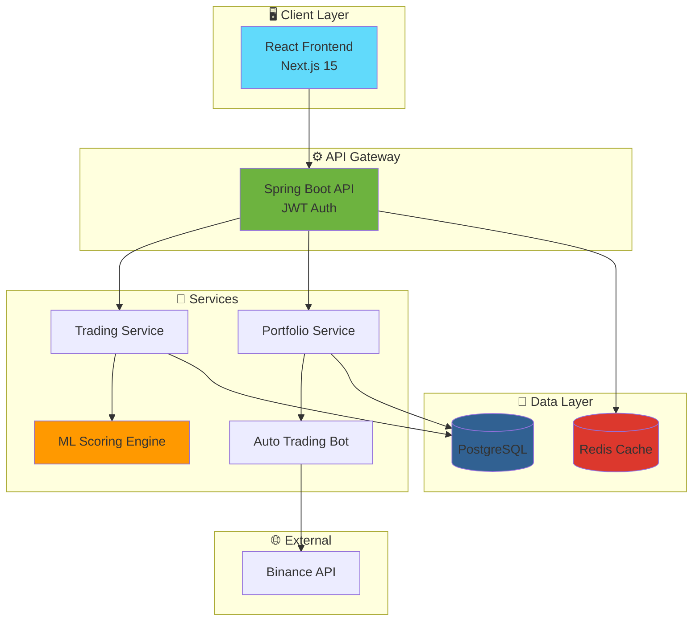
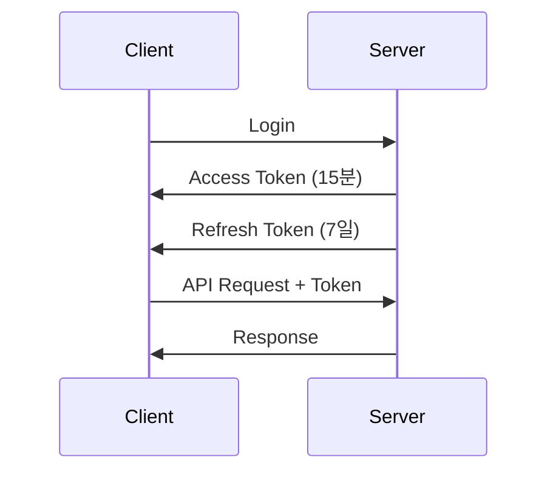
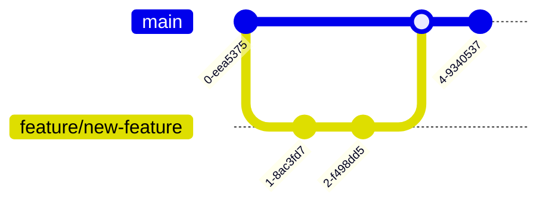

<div align="center">

<!-- 헤더 배너 -->


<!-- 배지 섹션 -->
<p align="center">
  
  
  
</p>

<p align="center">
  <a href="https://github.com/kimminkyu-link/coin_trading_journal/actions/workflows/frontend-ci.yml">
    
  </a>
  <a href="https://github.com/kimminkyu-link/coin_trading_journal/actions/workflows/backend-ci.yml">
    
  </a>
  <a href="https://github.com/kimminkyu-link/coin_trading_journal/actions/workflows/deploy.yml">
    
  </a>
</p>

<!-- 간단한 설명 -->
<h3 align="center">
  🚀 차세대 암호화폐 트레이딩 플랫폼 🚀
</h3>

<p align="center">
  <b>실시간 거래 기록</b> • <b>AI 성과 분석</b> • <b>자동매매 시스템</b> • <b>백테스팅 엔진</b>
</p>

<br/>

<!-- 빠른 링크 -->
<p align="center">
  <a href="#-핵심-기능"><b>핵심 기능</b></a> •
  <a href="#-기술-스택"><b>기술 스택</b></a> •
  <a href="#-시작하기"><b>시작하기</b></a> •
  <a href="#-api-문서"><b>API 문서</b></a> •
  <a href="#-기여하기"><b>기여하기</b></a>
</p>

</div>

<br/>

---

## 🎯 **핵심 기능**

<table>
<tr>
<td width="50%">

### 📊 **트레이딩 저널**


- ✨ **Binance API 자동 동기화**
- 📈 **실시간 포트폴리오 추적**
- 📉 **수익률 자동 계산**
- 🎯 **전략별 성과 분석**
- 📅 **시간대별 통계**

</td>
<td width="50%">

### 🤖 **AI/ML 분석 엔진**


- 🧠 **거래 패턴 자동 분석**
- 📊 **성과 점수화 시스템**
- 🔮 **예측 모델링**
- 🎲 **리스크 평가**
- 📚 **학습 기반 개선**

</td>
</tr>
<tr>
<td width="50%">

### ⚡ **자동매매 시스템**


- 🤖 **다중 전략 동시 운영**
- 🛡️ **자동 손절/익절**
- ⚖️ **포지션 자동 관리**
- 📡 **실시간 시장 모니터링**
- 🔄 **전략 자동 전환**

</td>
<td width="50%">

### 🧪 **백테스팅 플랫폼**


- 📈 **과거 데이터 시뮬레이션**
- 🎯 **전략 성과 검증**
- 📊 **상세 리포트 생성**
- 🔬 **파라미터 최적화**
- 💡 **개선점 자동 도출**

</td>
</tr>
</table>

<br/>

---

## 🛠️ **기술 스택**

<div align="center">

### **Frontend**
<p>
  
  
  
  
</p>

### **Backend**
<p>
  
  
  
  
</p>

### **AI/ML**
<p>
  
  
  
  
</p>

### **Infrastructure**
<p>
  
  
  
  
</p>

</div>

<br/>

---

## 🏗️ **시스템 아키텍처**

<div align="center">


```mermaid
graph TB
    subgraph "🖥️ Client Layer"
        A[React Frontend<br/>Next.js 15]
    end
    
    subgraph "⚙️ API Gateway"
        B[Spring Boot API<br/>JWT Auth]
    end
    
    subgraph "🧠 Services"
        C[Trading Service]
        D[Portfolio Service]
        E[ML Scoring Engine]
        F[Auto Trading Bot]
    end
    
    subgraph "💾 Data Layer"
        G[(PostgreSQL)]
        H[(Redis Cache)]
    end
    
    subgraph "🌐 External"
        I[Binance API]
    end
    
    A --> B
    B --> C
    B --> D
    C --> E
    D --> F
    C --> G
    D --> G
    B --> H
    F --> I
    
    style A fill:#61DAFB
    style B fill:#6DB33F
    style E fill:#FF9900
    style G fill:#316192
    style H fill:#DC382D
```

</div>

<br/>

---

## 🚀 **시작하기**

### **📋 사전 요구사항**

<table>
<tr>
<td>

**필수 도구**
- 🟢 Node.js 20+
- ☕ Java 17+
- 🐍 Python 3.11+
- 🐳 Docker & Docker Compose

</td>
<td>

**데이터베이스**
- 🐘 PostgreSQL 15+
- 🔴 Redis 7.0+

</td>
</tr>
</table>

### **⚡ 빠른 설치**

<details>
<summary><b>🔧 자세한 설치 과정 보기</b></summary>

#### **1️⃣ 저장소 클론**
```bash
git clone https://github.com/kimminkyu-link/coin_trading_journal.git
cd coin_trading_journal
```

#### **2️⃣ 환경 변수 설정**
```bash
# Frontend 환경 변수
cp frontend/.env.example frontend/.env.local

# Backend 환경 변수
cp backend/src/main/resources/application.yml.example \
   backend/src/main/resources/application.yml
```

#### **3️⃣ Docker로 DB 실행**
```bash
docker-compose up -d postgres redis
```

#### **4️⃣ 서비스 실행**

<table>
<tr>
<td>

**Backend** 🚀
```bash
cd backend
./gradlew bootRun
```
➡️ http://localhost:8080

</td>
<td>

**Frontend** 🎨
```bash
cd frontend
npm install
npm run dev
```
➡️ http://localhost:3000

</td>
</tr>
</table>

</details>

### **🐳 Docker 한 번에 실행**

```bash
docker-compose up -d
```

<br/>

---

## 📊 **API 문서**

<div align="center">

### **🔗 주요 엔드포인트**

| 카테고리 | 메소드 | 경로 | 설명 |
|:---:|:---:|:---|:---|
| **🔐 인증** | `POST` | `/api/auth/login` | 사용자 로그인 |
| | `POST` | `/api/auth/refresh` | 토큰 갱신 |
| | `GET` | `/api/auth/me` | 현재 사용자 정보 |
| **💹 거래** | `GET` | `/api/trades` | 거래 목록 조회 |
| | `POST` | `/api/trades` | 거래 생성 |
| | `POST` | `/api/trades/sync` | Binance 동기화 |
| **💼 포트폴리오** | `GET` | `/api/portfolio` | 포트폴리오 조회 |
| | `GET` | `/api/portfolio/summary` | 포트폴리오 요약 |
| **📈 통계** | `GET` | `/api/trades/statistics` | 거래 통계 |

</div>

### **📖 Swagger 문서**
> 🔗 **Production**: https://coin-trading-journal-production.up.railway.app/swagger-ui

<br/>

---

## 🔐 **보안**

<div align="center">

<table>
<tr>
<td align="center">

### **🛡️ JWT 인증**

```mermaid
sequenceDiagram
    Client->>Server: Login
    Server->>Client: Access Token (15분)
    Server->>Client: Refresh Token (7일)
    Client->>Server: API Request + Token
    Server->>Client: Response
```

</td>
<td align="center">

### **🔒 보안 기능**
- ✅ OAuth 2.0 (Google)
- ✅ JWT 토큰 인증
- ✅ AES-256 암호화
- ✅ CORS 설정
- ✅ Rate Limiting

</td>
</tr>
</table>

</div>

<br/>

---

## 📈 **성능 메트릭**

<div align="center">

| 지표 | 목표 | 현재 | 상태 |
|:---:|:---:|:---:|:---:|
| **API 응답 시간** | < 200ms | 150ms | 🟢 |
| **페이지 로드** | < 2s | 1.8s | 🟢 |
| **WebSocket 지연** | < 50ms | 45ms | 🟢 |
| **DB 쿼리** | < 100ms | 80ms | 🟢 |

</div>

<br/>

---

## 🤝 **기여하기**

<div align="center">

### **브랜치 전략**


```mermaid
gitGraph
    commit
    branch feature/new-feature
    checkout feature/new-feature
    commit
    commit
    checkout main
    merge feature/new-feature
    commit
```

</div>

### **커밋 컨벤션**

| 타입 | 설명 | 예시 |
|:---:|:---|:---|
| `feat` | 새로운 기능 | `feat: 실시간 차트 추가` |
| `fix` | 버그 수정 | `fix: 로그인 오류 해결` |
| `docs` | 문서 수정 | `docs: API 문서 업데이트` |
| `style` | 코드 포맷팅 | `style: 코드 정리` |
| `refactor` | 코드 리팩토링 | `refactor: 서비스 로직 개선` |

<br/>

---

## 🐛 **트러블슈팅**

<details>
<summary><b>💡 자주 발생하는 문제 해결</b></summary>

### **Frontend 빌드 오류**
```bash
rm -rf node_modules .next
npm install
npm run build
```

### **Backend 빌드 오류**
```bash
./gradlew clean build --refresh-dependencies
```

### **Docker 이슈**
```bash
docker-compose down -v
docker-compose up -d
```

</details>

<br/>

---

## 📄 **라이선스**

<div align="center">

이 프로젝트는 **MIT License** 하에 배포됩니다.

자세한 내용은 [LICENSE](LICENSE) 파일을 참조하세요.

</div>

<br/>

---

## 💬 **지원 & 커뮤니티**

<div align="center">

<a href="https://github.com/kimminkyu-link/coin_trading_journal/issues">
  
</a>
<a href="https://github.com/kimminkyu-link/coin_trading_journal/discussions">
  
</a>
<a href="mailto:support@example.com">
  
</a>

</div>

<br/>

---

<div align="center">

### **⭐ Star를 눌러주세요!**

이 프로젝트가 도움이 되었다면, ⭐ **Star**를 눌러주세요!

<br/>


**Made with 💜 by Crypto Trading Journal Team**

</div>