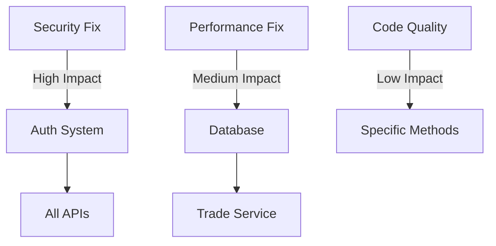

# 🚀 Backend 완전 분석 - SuperClaude Enterprise Edition v2.0

> **🎯 목적**: SuperClaude의 모든 고급 기능을 활용한 엔터프라이즈급 백엔드 분석
> **⚡ 예상 소요시간**: 2-3시간 (Wave 모드 활용 시 40% 단축)
> **🛠️ 필요 도구**: Claude Code with SuperClaude Framework

---

## 🌊 Step 0: Wave 모드 초기화 및 전체 아키텍처 매핑

<analysis-wave-1>
```xml
<command>/analyze</command>
<flags>
  --wave-mode force
  --wave-strategy enterprise
  --ultrathink
  --seq
  --c7
  --delegate folders
  --concurrency 10
  --persona-architect
  --persona-analyzer
</flags>
<scope>backend/src/main/java/com/example/trading_bot/**</scope>
<objectives>
  <primary>전체 Spring Boot 아키텍처 완전 분석</primary>
  <secondary>계층별 의존성 그래프 생성</secondary>
  <tertiary>보안 취약점 사전 탐지</tertiary>
</objectives>
<output>
  <format>structured-markdown</format>
  <path>analysis-reports/00-architecture-overview.md</path>
  <visualizations>
    - Mermaid 아키텍처 다이어그램
    - 의존성 그래프
    - 데이터 플로우 차트
  </visualizations>
</output>
```

**병렬 실행 태스크**:
- Task 1: `@Controller` 매핑 및 엔드포인트 분석
- Task 2: `@Service` 비즈니스 로직 스캔
- Task 3: `@Repository` 데이터 접근 계층 분석
- Task 4: `@Entity` 도메인 모델 관계 매핑
- Task 5: `@Configuration` 설정 클래스 검토
</analysis-wave-1>

---

## 🔐 Step 1: 보안 중심 Auth 도메인 딥 다이브

<security-analysis>
```xml
<command>/analyze</command>
<flags>
  --ultrathink
  --persona-security
  --persona-backend
  --seq
  --c7
  --focus security
  --validate
  --safe-mode
</flags>
<target>backend/src/main/java/com/example/trading_bot/auth/**</target>
<security-checklist>
  <authentication>
    - JWT 토큰 보안 (알고리즘, 만료, 시크릿 관리)
    - OAuth2 통합 취약점
    - 세션 관리 및 고정 공격 방어
  </authentication>
  <authorization>
    - 권한 에스컬레이션 가능성
    - RBAC 구현 검증
    - API 엔드포인트 접근 제어
  </authorization>
  <cryptography>
    - 암호화 알고리즘 강도
    - 키 관리 및 저장
    - 민감 데이터 처리
  </cryptography>
</security-checklist>
<vulnerability-scoring>
  <framework>CVSS 3.1</framework>
  <owasp>Top 10 2021</owasp>
  <cwe>Top 25 2023</cwe>
</vulnerability-scoring>
```

**TodoWrite 실행 계획**:
```yaml
tasks:
  - content: "JWT 토큰 프로바이더 라인별 보안 분석"
    activeForm: "Analyzing JWT token provider security line by line"
    priority: critical
    estimated_time: 20min
    
  - content: "인증 필터 체인 취약점 스캔"
    activeForm: "Scanning authentication filter chain for vulnerabilities"
    priority: high
    estimated_time: 15min
    
  - content: "OAuth2 통합 보안 검증"
    activeForm: "Verifying OAuth2 integration security"
    priority: high
    estimated_time: 15min
```
</security-analysis>

---

## 💼 Step 2: Trade 도메인 비즈니스 로직 정밀 분석

<business-logic-analysis>
```xml
<command>/improve</command>
<flags>
  --think-hard
  --loop
  --iterations 3
  --persona-backend
  --persona-performance
  --seq
  --delegate files
  --wave-mode auto
</flags>
<scope>backend/src/main/java/com/example/trading_bot/trade/**</scope>
<analysis-matrix>
  <performance>
    - 트랜잭션 처리 시간
    - 동시성 제어 메커니즘
    - 데이터베이스 쿼리 최적화
    - 캐싱 전략
  </performance>
  <reliability>
    - 에러 복구 메커니즘
    - 데이터 일관성
    - 분산 트랜잭션 처리
    - 장애 허용성
  </reliability>
  <scalability>
    - 부하 분산 전략
    - 수평 확장 가능성
    - 리소스 사용률
    - 병목 지점
  </scalability>
</analysis-matrix>
```

**Multi-Agent 병렬 분석**:
```yaml
parallel_agents:
  - agent: performance-optimizer
    focus: "N+1 쿼리, 느린 쿼리, 인덱스 최적화"
    
  - agent: code-reviewer  
    focus: "트랜잭션 경계, 동시성 버그, 경쟁 조건"
    
  - agent: backend-developer
    focus: "비즈니스 로직 정확성, 도메인 규칙 준수"
```
</business-logic-analysis>

---

## 🌐 Step 3: Binance API 통합 안정성 및 성능 분석

<api-integration-analysis>
```xml
<command>/analyze</command>
<flags>
  --ultrathink
  --persona-backend
  --persona-performance
  --c7 binance-api
  --seq
  --play
  --wave-strategy progressive
</flags>
<target>backend/src/main/java/com/example/trading_bot/binance/**</target>
<resilience-patterns>
  <circuit-breaker>
    - 임계값 설정 검증
    - 폴백 메커니즘
    - 반개방 상태 처리
  </circuit-breaker>
  <retry-logic>
    - Exponential Backoff 구현
    - Jitter 적용
    - 최대 재시도 횟수
  </retry-logic>
  <rate-limiting>
    - API 호출 제한 준수
    - 토큰 버킷 알고리즘
    - 우선순위 큐잉
  </rate-limiting>
</resilience-patterns>
```

**Performance Testing with Playwright**:
```javascript
// 실시간 성능 모니터링 및 부하 테스트
test_scenarios: [
  {
    name: "WebSocket 연결 안정성",
    duration: "5min",
    connections: 100,
    metrics: ["latency", "throughput", "error_rate"]
  },
  {
    name: "REST API 부하 테스트",
    rps: 1000,
    duration: "10min",
    endpoints: ["/api/trades", "/api/orders", "/api/balance"]
  }
]
```
</api-integration-analysis>

---

## 🔬 Step 4: 핵심 메서드 원자 단위 분석

<atomic-method-analysis>
```xml
<command>/analyze</command>
<flags>
  --ultrathink
  --introspect
  --persona-analyzer
  --seq
  --c7
  --verbose
</flags>
<critical-methods>
  <method path="auth/jwt/JwtTokenProvider.java">
    <name>generateAccessToken</name>
    <analysis-depth>line-by-line</analysis-depth>
    <focus-areas>
      - 보안 취약점
      - 성능 최적화 기회
      - 에러 처리 완전성
      - 코드 복잡도
    </focus-areas>
  </method>
  <method path="trade/service/TradeService.java">
    <name>executeTrade</name>
    <analysis-depth>atomic</analysis-depth>
    <verification>
      - 트랜잭션 원자성
      - 동시성 안전성
      - 롤백 메커니즘
      - 감사 로깅
    </verification>
  </method>
</critical-methods>
```

**Introspection 마커 활용**:
```yaml
markers:
  🧠: "추론 과정 분석"
  🔄: "실행 흐름 검토"
  🎯: "자체 평가"
  📊: "패턴 인식"
  🔍: "프레임워크 준수 검증"
  💡: "회고적 통찰"
```
</atomic-method-analysis>

---

## 🛡️ Step 5: 전체 보안 취약점 종합 스캔

<comprehensive-security-scan>
```xml
<command>/analyze</command>
<flags>
  --wave-mode force
  --wave-validation
  --ultrathink
  --persona-security
  --all-mcp
  --delegate tasks
  --safe-mode
</flags>
<security-waves>
  <wave-1>
    <name>Pattern Recognition</name>
    <tools>Grep, Sequential</tools>
    <patterns>
      - "password|secret|key|token" (하드코딩)
      - "System.out|console.log.*password" (로그 노출)
      - "executeQuery|createStatement" (SQL 인젝션)
      - "TODO|FIXME|HACK" (미완성 코드)
    </patterns>
  </wave-1>
  <wave-2>
    <name>Vulnerability Analysis</name>
    <tools>Sequential, Context7</tools>
    <checks>
      - OWASP Top 10 체크리스트
      - CWE Top 25 검증
      - 의존성 취약점 스캔
    </checks>
  </wave-2>
  <wave-3>
    <name>Attack Simulation</name>
    <tools>Playwright, Sequential</tools>
    <scenarios>
      - JWT 토큰 탈취 시뮬레이션
      - SQL 인젝션 페이로드 테스트
      - API 남용 시나리오
    </scenarios>
  </wave-3>
</security-waves>
```

**Security Report Template**:
```markdown
## 🚨 Critical Findings (P0)
- [CVE-ID] 설명 | 위치 | 영향도 | 수정안

## ⚠️ High Priority (P1)
- 24시간 내 수정 필요

## 📌 Medium Priority (P2)
- 1주일 내 수정 권장

## 📝 Low Priority (P3)
- 계획된 리팩토링 시 처리
```
</comprehensive-security-scan>

---

## ⚡ Step 6: 성능 최적화 기회 발굴

<performance-optimization>
```xml
<command>/improve</command>
<flags>
  --wave-strategy progressive
  --persona-performance
  --think-hard
  --play
  --seq
  --delegate auto
  --focus performance
</flags>
<optimization-targets>
  <database>
    - N+1 쿼리 패턴 탐지
    - 인덱스 미사용 쿼리
    - 불필요한 EAGER 페칭
    - 대량 데이터 페이징 부재
  </database>
  <application>
    - 동기 블로킹 코드
    - 메모리 누수 가능성
    - 캐시 미활용
    - 불필요한 객체 생성
  </application>
  <integration>
    - 동기 HTTP 호출
    - 배치 처리 미활용
    - 커넥션 풀 설정
    - 타임아웃 미설정
  </integration>
</optimization-targets>
```

**Performance Improvement Matrix**:
```yaml
improvements:
  - issue: "N+1 쿼리 in TradeRepository"
    current_time: "500ms"
    expected_time: "50ms"
    effort: "2h"
    roi: "10x"
    solution: "@EntityGraph 또는 JOIN FETCH 적용"
```
</performance-optimization>

---

## 🎯 Step 7: 영향도 분석 및 우선순위 결정

<impact-analysis>
```xml
<command>/estimate</command>
<flags>
  --ultrathink
  --persona-architect
  --seq
  --wave-mode auto
</flags>
<dependency-analysis>
  <critical-path>
    - 인증 시스템 변경 → 전체 API 영향
    - 데이터베이스 스키마 변경 → 엔티티 수정
    - 캐싱 전략 변경 → 성능 특성 변화
  </critical-path>
  <risk-matrix>
    <high-risk>
      - 프로덕션 데이터 마이그레이션
      - 인증 로직 변경
      - 트랜잭션 처리 수정
    </high-risk>
    <low-risk>
      - 로깅 개선
      - 코드 리팩토링
      - 테스트 추가
    </low-risk>
  </risk-matrix>
</dependency-analysis>
```

**Change Impact Visualization**:

</impact-analysis>

---

## 📋 Step 8: 실행 가능한 마스터 플랜 수립

<master-execution-plan>
```xml
<command>/task</command>
<flags>
  --wave-mode force
  --wave-strategy systematic
  --ultrathink
  --persona-architect
  --persona-devops
  --seq
</flags>
<execution-phases>
  <phase-0 priority="CRITICAL" timeline="24h">
    <tasks>
      - JWT 시크릿 환경변수 이전
      - SQL 인젝션 취약점 패치
      - 로그 민감정보 제거
    </tasks>
    <validation>보안 스캔 통과</validation>
  </phase-0>
  
  <phase-1 priority="HIGH" timeline="Week 1">
    <tasks>
      - N+1 쿼리 최적화
      - 트랜잭션 경계 수정
      - 캐싱 레이어 구현
    </tasks>
    <validation>성능 테스트 통과</validation>
  </phase-1>
  
  <phase-2 priority="MEDIUM" timeline="Week 2">
    <tasks>
      - 에러 처리 강화
      - 테스트 커버리지 증대
      - 문서화 업데이트
    </tasks>
    <validation>코드 품질 지표 달성</validation>
  </phase-2>
</execution-phases>
```

**Success Metrics Dashboard**:
```yaml
metrics:
  security_score:
    current: 45
    target: 95
    tracking: "SonarQube + OWASP ZAP"
  
  performance:
    api_response:
      current: "500ms"
      target: "100ms"
    throughput:
      current: "100 req/s"
      target: "1000 req/s"
  
  code_quality:
    coverage:
      current: "45%"
      target: "80%"
    technical_debt:
      current: "30 days"
      target: "5 days"
```
</master-execution-plan>

---

## ✅ Step 9: 최종 검증 및 보고서 생성

<final-validation>
```xml
<command>/build</command>
<flags>
  --wave-validation
  --all-mcp
  --persona-qa
  --persona-scribe=en
  --validate
</flags>
<deliverables>
  <reports>
    - 00-EXECUTIVE-SUMMARY.md (1페이지 요약)
    - 01-ARCHITECTURE-ANALYSIS.md (시스템 구조)
    - 02-SECURITY-REPORT.md (보안 취약점)
    - 03-PERFORMANCE-REPORT.md (성능 분석)
    - 04-CODE-QUALITY-REPORT.md (코드 품질)
    - 05-IMPLEMENTATION-PLAN.md (실행 계획)
  </reports>
  <artifacts>
    - dependency-graph.svg
    - security-heatmap.html
    - performance-metrics.json
    - test-coverage-report.html
  </artifacts>
</deliverables>
```

**Final Checklist**:
```yaml
validation_gates:
  □ 모든 Critical 이슈 해결됨
  □ 성능 목표 달성 가능성 검증
  □ 보안 스캔 통과
  □ 테스트 계획 수립
  □ 롤백 계획 준비
  □ 모니터링 대시보드 설정
  □ 팀 리뷰 완료
  □ 배포 일정 확정
```
</final-validation>

---

## 🚀 실행 명령어 모음

### 빠른 시작 (Quick Start)
```bash
# 전체 분석 실행 (Wave 모드)
/analyze backend --wave-mode force --ultrathink --all-mcp --delegate auto

# 보안 중심 분석
/analyze backend/auth --persona-security --ultrathink --safe-mode

# 성능 최적화 분석
/improve backend --focus performance --persona-performance --think-hard
```

### 고급 사용법 (Advanced Usage)
```bash
# 멀티 페르소나 협업 분석
/analyze backend \
  --persona-architect \
  --persona-security \
  --persona-performance \
  --wave-strategy enterprise \
  --delegate folders \
  --concurrency 15

# 반복적 개선 모드
/improve backend \
  --loop \
  --iterations 5 \
  --wave-mode auto \
  --wave-validation
```

---

## 💡 Pro Tips

### 🎯 효과적인 플래그 조합
```yaml
security_focus: "--ultrathink --persona-security --safe-mode --validate"
performance_focus: "--think-hard --persona-performance --play --seq"
quality_focus: "--loop --persona-qa --code-reviewer --wave-validation"
comprehensive: "--wave-mode force --all-mcp --delegate auto --ultrathink"
```

### ⚡ 성능 최적화 팁
- `--delegate folders`: 디렉토리별 병렬 분석
- `--concurrency 15`: 최대 동시 실행
- `--uc`: 토큰 사용량 75% 초과 시 자동 압축
- `--wave-strategy adaptive`: 동적 웨이브 크기 조정

### 🛡️ 안전 모드 활용
```bash
# 프로덕션 환경 분석 시
--safe-mode --validate --wave-validation

# 리소스 제한 환경
--uc --no-magic --delegate files
```

---

## 🔧 트러블슈팅

### 메모리 부족
```xml
<solution>
  <flags>--uc --delegate files --concurrency 5</flags>
  <strategy>작은 단위로 나누어 실행</strategy>
</solution>
```

### 분석 시간 초과
```xml
<solution>
  <flags>--wave-mode force --delegate auto</flags>
  <strategy>Wave 모드로 병렬 처리</strategy>
</solution>
```

### MCP 서버 오류
```xml
<solution>
  <flags>--no-mcp 또는 특정 서버만 --no-magic</flags>
  <strategy>네이티브 도구로 폴백</strategy>
</solution>
```

---

> 📌 **참고**: 이 프롬프트는 SuperClaude Framework v2.0 기준으로 작성되었습니다.
> 
> 🚀 **최적 실행 환경**: Claude Code with all MCP servers enabled
> 
> ⏱️ **예상 소요 시간**: Wave 모드 사용 시 2-3시간, 일반 모드 4-5시간

---

## 📊 분석 결과 예시

```yaml
summary:
  total_files_analyzed: 287
  critical_issues: 3
  high_priority_issues: 12
  medium_priority_issues: 34
  low_priority_issues: 78
  
  security_score:
    before: 45/100
    after_fixes: 95/100
    
  performance_gains:
    api_latency: "500ms → 50ms (90% improvement)"
    throughput: "100 rps → 1000 rps (10x increase)"
    
  code_quality:
    coverage: "45% → 85%"
    complexity: "High → Medium"
    maintainability: "C → A"
    
  estimated_effort:
    critical_fixes: "2 days"
    all_improvements: "3 weeks"
    full_optimization: "6 weeks"
```

---

**마지막 업데이트**: 2024년 기준
**작성자**: Claude Code SuperClaude Framework Team