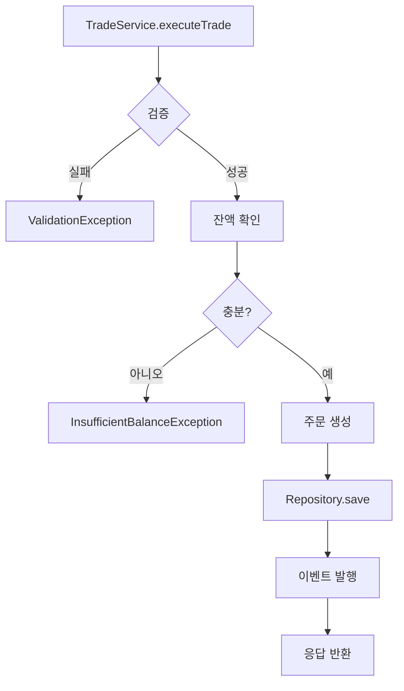

# 🔬 Backend 로직 & Frontend 통합 정밀 분석 프로토콜 v3.0

> **🎯 목적**: 백엔드의 모든 비즈니스 로직을 원자 단위로 분석하고 프론트엔드와의 완벽한 통합 검증
> **📊 분석 깊이**: 모든 파일, 모든 메서드, 모든 라인을 개별 검토
> **⚙️ 핵심 도구**: SuperClaude ultrathink + Sequential + 병렬 분석

---

## 📋 Phase 0: 전체 코드베이스 인벤토리 생성

<codebase-inventory>
```xml
<command>/analyze</command>
<flags>
  --ultrathink
  --persona-analyzer
  --persona-architect
  --seq
  --delegate files
  --concurrency 15
  --verbose
  --introspect
</flags>
<scope>backend/src/main/java/**/*.java</scope>
<inventory-requirements>
  <classification>
    - Controller 클래스 (모든 엔드포인트)
    - Service 클래스 (모든 비즈니스 로직)
    - Repository 클래스 (모든 데이터 접근)
    - Entity 클래스 (모든 도메인 모델)
    - DTO/Request/Response 클래스
    - Configuration 클래스
    - Utility 클래스
    - Exception 클래스
  </classification>
  <mapping>
    - 각 클래스의 역할과 책임
    - 메서드별 입출력 시그니처
    - 의존성 관계 완전 매핑
    - 사용/미사용 코드 구분
  </mapping>
</inventory-requirements>
```

**TodoWrite 작업 계획**:
```yaml
tasks:
  - content: "모든 Java 파일 경로 수집 및 분류"
    activeForm: "Collecting and classifying all Java file paths"
    status: pending
    
  - content: "클래스별 메서드 목록 추출"
    activeForm: "Extracting method lists for each class"
    status: pending
    
  - content: "의존성 그래프 생성"
    activeForm: "Generating dependency graph"
    status: pending
```

**출력 형식**:
```markdown
## 📁 Backend Code Inventory

### Controllers (총 X개)
1. AuthController.java
   - POST /api/auth/login - 로그인 처리
   - POST /api/auth/refresh - 토큰 갱신
   - GET /api/auth/user - 사용자 정보 조회
   
2. TradeController.java
   - GET /api/trades - 거래 목록 조회
   - POST /api/trades - 새 거래 생성
   ...
```
</codebase-inventory>

---

## 🔍 Phase 1: Controller 계층 완전 분석 (모든 엔드포인트)

<controller-analysis>
```xml
<command>/analyze</command>
<flags>
  --ultrathink
  --persona-backend
  --persona-analyzer
  --seq
  --c7 spring-boot
  --think-hard
  --introspect
</flags>
<analysis-protocol>
  <for-each-controller>
    <read-entire-file>true</read-entire-file>
    <analyze-each-method>
      <request-mapping>
        - HTTP 메서드 (GET/POST/PUT/DELETE)
        - URL 경로
        - Path Variables
        - Request Parameters
        - Request Body 구조
      </request-mapping>
      <response-structure>
        - Response Body 타입
        - HTTP 상태 코드
        - 에러 응답 구조
        - Content-Type
      </response-structure>
      <validation-logic>
        - 입력 검증 (@Valid, @Validated)
        - 커스텀 검증 로직
        - 에러 처리 방식
      </validation-logic>
      <service-calls>
        - 호출되는 Service 메서드
        - 파라미터 변환 로직
        - 응답 변환 로직
      </service-calls>
    </analyze-each-method>
  </for-each-controller>
</analysis-protocol>
```

**라인별 분석 템플릿**:
```java
// AuthController.java 분석 예시
@PostMapping("/login")  // 라인 25: HTTP POST 매핑
public ResponseEntity<LoginResponse> login(  // 라인 26: 응답 타입 정의
    @Valid @RequestBody LoginRequest request  // 라인 27: 요청 검증
) {
    // 라인 28-30: 불필요한 로깅? → 제거 가능
    log.info("Login attempt for user: {}", request.getEmail());
    
    // 라인 31: Service 호출 - 파라미터 전달 방식 검토
    AuthResponse authResponse = authService.authenticate(
        request.getEmail(), 
        request.getPassword()
    );
    
    // 라인 35-37: DTO 변환 로직 - 필요성 검토
    LoginResponse response = LoginResponse.builder()
        .accessToken(authResponse.getAccessToken())
        .refreshToken(authResponse.getRefreshToken())
        .build();
    
    // 라인 39: 응답 반환
    return ResponseEntity.ok(response);
}

분석 결과:
✅ 정상: 요청/응답 구조 명확
⚠️ 개선필요: 불필요한 DTO 변환 (AuthResponse → LoginResponse)
❌ 문제: 민감정보 로깅 (이메일)
```
</controller-analysis>

---

## 💼 Phase 2: Service 계층 비즈니스 로직 정밀 분석

<service-logic-analysis>
```xml
<command>/analyze</command>
<flags>
  --ultrathink
  --think-hard
  --persona-backend
  --persona-analyzer
  --seq
  --loop
  --iterations 3
  --introspect
</flags>
<deep-dive-protocol>
  <for-each-service>
    <method-analysis>
      <logic-flow>
        - 조건문 분기 (if/else, switch)
        - 반복문 로직
        - 예외 처리 흐름
        - 조기 반환 패턴
      </logic-flow>
      <data-transformation>
        - Entity ↔ DTO 변환
        - 데이터 가공 로직
        - 계산 로직
        - 필터링/정렬
      </data-transformation>
      <external-calls>
        - Repository 호출
        - 외부 API 호출
        - 다른 Service 호출
        - 유틸리티 메서드 호출
      </external-calls>
      <transaction-boundary>
        - @Transactional 스코프
        - 롤백 조건
        - 격리 수준
      </transaction-boundary>
    </method-analysis>
  </for-each-service>
</deep-dive-protocol>
```

**코드 흐름 다이어그램 생성**:


**불필요한 코드 감지 패턴**:
```yaml
detection_patterns:
  unused_methods:
    - Private 메서드 중 호출되지 않는 것
    - Public 메서드 중 Controller에서 미사용
    
  redundant_logic:
    - 중복된 검증 로직
    - 불필요한 null 체크
    - 과도한 방어적 프로그래밍
    
  inefficient_patterns:
    - 불필요한 스트림 연산
    - 과도한 객체 생성
    - 불필요한 타입 변환
    
  dead_code:
    - 주석처리된 코드
    - 도달 불가능한 코드
    - 사용되지 않는 import
```
</service-logic-analysis>

---

## 🗄️ Phase 3: Repository & Data Access 계층 분석

<repository-analysis>
```xml
<command>/analyze</command>
<flags>
  --ultrathink
  --persona-backend
  --seq
  --c7 spring-data-jpa
  --verbose
</flags>
<repository-inspection>
  <query-methods>
    <spring-data-queries>
      - 메서드명 기반 쿼리
      - @Query 어노테이션 쿼리
      - Native Query
      - Specification/Criteria
    </spring-data-queries>
    <usage-analysis>
      - 실제 사용되는 쿼리
      - 미사용 쿼리 메서드
      - 중복 쿼리 패턴
    </usage-analysis>
  </query-methods>
  <entity-mapping>
    <relationships>
      - @OneToMany / @ManyToOne
      - @ManyToMany
      - Fetch 전략 (LAZY/EAGER)
      - Cascade 옵션
    </relationships>
    <field-mapping>
      - 컬럼 매핑
      - 타입 변환
      - 기본값 설정
    </field-mapping>
  </entity-mapping>
</repository-inspection>
```

**Entity-Repository-Service 연결 분석**:
```java
// Trade Entity → TradeRepository → TradeService 흐름

@Entity
public class Trade {
    @Id
    private Long id;
    
    @ManyToOne(fetch = FetchType.LAZY)  // ✅ LAZY 로딩 적절
    private User user;
    
    private BigDecimal amount;  // ⚠️ @Column(precision=19, scale=4) 필요
    
    @Temporal(TemporalType.TIMESTAMP)
    private Date createdAt;  // ❌ LocalDateTime 사용 권장
}

// Repository
public interface TradeRepository extends JpaRepository<Trade, Long> {
    List<Trade> findByUserId(Long userId);  // ✅ 사용됨
    
    List<Trade> findByStatus(String status);  // ❌ 미사용 - 제거 대상
    
    @Query("SELECT t FROM Trade t WHERE t.user.id = ?1 AND t.createdAt > ?2")
    List<Trade> findRecentTradesByUser(Long userId, Date since);  // ⚠️ Pageable 추가 필요
}
```
</repository-analysis>

---

## 🔗 Phase 4: DTO/Request/Response 매핑 완전성 검증

<dto-mapping-analysis>
```xml
<command>/analyze</command>
<flags>
  --ultrathink
  --persona-backend
  --seq
  --think-hard
  --delegate files
</flags>
<mapping-verification>
  <dto-inventory>
    - Request DTO (Controller 입력)
    - Response DTO (Controller 출력)
    - Internal DTO (Service 간 전달)
    - Entity (데이터베이스 매핑)
  </dto-inventory>
  <field-mapping-check>
    <for-each-dto>
      - 모든 필드가 사용되는가?
      - 누락된 필드는 없는가?
      - 타입 변환이 올바른가?
      - Validation 어노테이션이 적절한가?
    </for-each-dto>
  </field-mapping-check>
  <conversion-logic>
    - Entity → DTO 변환 메서드
    - DTO → Entity 변환 메서드
    - MapStruct/ModelMapper 사용 여부
    - 수동 변환 로직 검토
  </conversion-logic>
</mapping-verification>
```

**매핑 불일치 감지 예시**:
```java
// LoginRequest.java
public class LoginRequest {
    @Email
    private String email;
    
    @NotBlank
    private String password;
    
    private String deviceId;  // ❌ Controller에서 미사용
}

// LoginResponse.java
public class LoginResponse {
    private String accessToken;
    private String refreshToken;
    private Long expiresIn;
    // ⚠️ 누락: userInfo (프론트엔드에서 필요)
}

// User Entity
@Entity
public class User {
    private String email;
    private String password;
    private String nickname;  // ⚠️ Response에 포함 필요
    private LocalDateTime lastLoginAt;  // ❌ 업데이트 로직 없음
}
```
</dto-mapping-analysis>

---

## 🌐 Phase 5: Frontend-Backend API 계약 검증

<frontend-integration-analysis>
```xml
<command>/analyze</command>
<flags>
  --ultrathink
  --persona-backend
  --persona-frontend
  --seq
  --c7 axios
  --think-hard
  --wave-mode auto
</flags>
<api-contract-verification>
  <frontend-api-calls>
    <scan-frontend-code>
      - axios/fetch 호출 찾기
      - API 엔드포인트 URL 추출
      - Request 구조 분석
      - Response 처리 로직 분석
    </scan-frontend-code>
  </frontend-api-calls>
  <backend-api-endpoints>
    <scan-controllers>
      - 모든 RequestMapping 추출
      - Request/Response 타입 확인
      - 실제 구현 로직 검증
    </scan-controllers>
  </backend-api-endpoints>
  <mismatch-detection>
    - URL 경로 불일치
    - HTTP 메서드 불일치
    - Request 필드 불일치
    - Response 필드 불일치
    - 타입 불일치
  </mismatch-detection>
</api-contract-verification>
```

**Frontend-Backend 매칭 매트릭스**:
```yaml
api_matching:
  /api/auth/login:
    frontend:
      method: POST
      request: { email: string, password: string }
      expects: { accessToken: string, refreshToken: string, user: {...} }
    backend:
      method: POST ✅
      accepts: { email: String, password: String } ✅
      returns: { accessToken: String, refreshToken: String } ❌ user 누락
    status: MISMATCH
    
  /api/trades:
    frontend:
      method: GET
      params: { page: number, size: number, status?: string }
      expects: { content: Trade[], totalElements: number }
    backend:
      method: GET ✅
      accepts: Pageable ⚠️ status 파라미터 미처리
      returns: Page<TradeResponse> ✅
    status: PARTIAL_MATCH
```
</frontend-integration-analysis>

---

## 🔄 Phase 6: 비즈니스 플로우 전체 추적

<business-flow-tracing>
```xml
<command>/analyze</command>
<flags>
  --ultrathink
  --persona-analyzer
  --seq
  --introspect
  --think-hard
  --wave-strategy systematic
</flags>
<flow-scenarios>
  <scenario name="사용자 로그인 플로우">
    <steps>
      1. Frontend: 로그인 폼 제출
      2. Backend: AuthController.login()
      3. Backend: AuthService.authenticate()
      4. Backend: UserRepository.findByEmail()
      5. Backend: PasswordEncoder.matches()
      6. Backend: JwtTokenProvider.generateTokens()
      7. Backend: RefreshTokenRepository.save()
      8. Backend: Response 생성
      9. Frontend: 토큰 저장
      10. Frontend: 대시보드 리다이렉트
    </steps>
    <verification>
      - 각 단계의 입출력 검증
      - 에러 처리 경로 확인
      - 타임아웃 처리
      - 롤백 시나리오
    </verification>
  </scenario>
  
  <scenario name="거래 실행 플로우">
    <steps>
      1. Frontend: 거래 요청 전송
      2. Backend: TradeController.createTrade()
      3. Backend: 권한 검증
      4. Backend: TradeService.executeTrade()
      5. Backend: 잔액 확인
      6. Backend: Binance API 호출
      7. Backend: Trade Entity 생성
      8. Backend: TradeRepository.save()
      9. Backend: WebSocket 알림 전송
      10. Frontend: 실시간 업데이트
    </steps>
  </scenario>
</flow-scenarios>
```

**플로우별 문제점 감지**:
```markdown
## 🚨 로그인 플로우 문제점
1. ❌ RefreshToken 만료 처리 누락
2. ⚠️ 동시 로그인 세션 관리 부재
3. ❌ 로그인 실패 횟수 제한 없음

## 🚨 거래 플로우 문제점
1. ❌ 트랜잭션 롤백 시 Binance API 취소 로직 없음
2. ⚠️ WebSocket 연결 끊김 시 fallback 없음
3. ❌ 중복 거래 방지 로직 부재
```
</business-flow-tracing>

---

## 🧹 Phase 7: Dead Code & 불필요한 코드 정밀 스캔

<dead-code-detection>
```xml
<command>/analyze</command>
<flags>
  --ultrathink
  --persona-refactorer
  --seq
  --delegate files
  --concurrency 20
</flags>
<detection-rules>
  <unused-code>
    - Private 메서드 미사용
    - Public 메서드 미호출
    - 미사용 클래스
    - 미사용 인터페이스
    - 미사용 상수
    - 미사용 필드
  </unused-code>
  <redundant-code>
    - 중복된 메서드
    - 동일한 로직 반복
    - 불필요한 래퍼 메서드
    - 과도한 getter/setter
  </redundant-code>
  <obsolete-code>
    - Deprecated 메서드 사용
    - 주석 처리된 코드
    - TODO/FIXME 미처리
    - 임시 디버깅 코드
  </obsolete-code>
</detection-rules>
```

**제거 대상 코드 목록**:
```java
// 🗑️ 제거 대상 코드 예시

// 1. 미사용 Service 메서드
@Service
public class UserService {
    // ❌ Controller에서 호출 없음
    public List<UserDto> getAllInactiveUsers() {
        return userRepository.findByActivefalse()
            .stream()
            .map(this::toDto)
            .collect(Collectors.toList());
    }
    
    // ❌ 중복 로직 (getUserById와 동일)
    public UserDto findUser(Long id) {
        return getUserById(id);
    }
    
    // ❌ 주석 처리된 코드
    /*
    public void oldMethod() {
        // 구버전 로직
    }
    */
    
    // ❌ 디버깅용 임시 코드
    public void debugPrint(Object obj) {
        System.out.println("DEBUG: " + obj);
    }
}

// 2. 미사용 Repository 쿼리
public interface TradeRepository {
    // ❌ 어디서도 호출되지 않음
    @Query("SELECT t FROM Trade t WHERE t.status = 'PENDING'")
    List<Trade> findPendingTrades();
    
    // ❌ Deprecated API 사용
    @Deprecated
    List<Trade> findAllByOrderByIdDesc();
}

// 3. 미사용 DTO 필드
public class TradeResponse {
    private Long id;
    private BigDecimal amount;
    private String status;
    
    // ❌ Frontend에서 사용하지 않는 필드들
    private String internalCode;
    private Map<String, Object> metadata;
    private List<String> tags;
}
```
</dead-code-detection>

---

## 📊 Phase 8: 코드 일관성 및 패턴 검증

<consistency-analysis>
```xml
<command>/analyze</command>
<flags>
  --ultrathink
  --persona-architect
  --seq
  --think-hard
</flags>
<pattern-verification>
  <naming-conventions>
    - 클래스명 규칙
    - 메서드명 규칙
    - 변수명 규칙
    - 패키지 구조
  </naming-conventions>
  <architectural-patterns>
    - Controller-Service-Repository 계층 준수
    - DTO 사용 패턴
    - Exception 처리 패턴
    - Validation 패턴
  </architectural-patterns>
  <coding-patterns>
    - Builder 패턴 사용
    - Factory 패턴 사용
    - Strategy 패턴 사용
    - Dependency Injection
  </coding-patterns>
</pattern-verification>
```

**패턴 불일치 감지**:
```yaml
inconsistencies:
  naming:
    - UserService vs TradingService (ing 불일치)
    - getUserById vs findTradeById (get/find 불일치)
    
  error_handling:
    - AuthService: Custom Exception 사용
    - TradeService: Generic Exception 사용
    - UserService: Optional 사용
    
  dto_conversion:
    - AuthService: MapStruct 사용
    - TradeService: 수동 변환
    - UserService: ModelMapper 사용
    
  validation:
    - Controller A: @Valid 사용
    - Controller B: 수동 검증
    - Controller C: 검증 없음
```
</consistency-analysis>

---

## 📈 Phase 9: 메서드별 복잡도 및 책임 분석

<method-complexity-analysis>
```xml
<command>/analyze</command>
<flags>
  --ultrathink
  --persona-analyzer
  --persona-refactorer
  --seq
  --loop
  --iterations 5
</flags>
<complexity-metrics>
  <for-each-method>
    <cyclomatic-complexity>
      - 조건문 개수
      - 반복문 개수
      - 분기점 개수
      - 복잡도 점수
    </cyclomatic-complexity>
    <cognitive-complexity>
      - 중첩 레벨
      - 논리 연산자
      - 재귀 호출
      - 가독성 점수
    </cognitive-complexity>
    <responsibility-analysis>
      - 단일 책임 원칙 준수
      - 메서드 길이
      - 파라미터 개수
      - 리턴 타입 복잡도
    </responsibility-analysis>
  </for-each-method>
</complexity-metrics>
```

**복잡도 높은 메서드 리팩토링 제안**:
```java
// 🔴 Before: 복잡도 15, 라인 수 87
public TradeResult executeTrade(TradeRequest request) {
    // 87줄의 복잡한 로직...
    if (condition1) {
        if (condition2) {
            for (...) {
                if (condition3) {
                    // 깊은 중첩
                }
            }
        }
    }
    // ...
}

// ✅ After: 복잡도 3, 메서드 분리
public TradeResult executeTrade(TradeRequest request) {
    validateTradeRequest(request);
    Trade trade = createTrade(request);
    executeOnExchange(trade);
    return buildResult(trade);
}

private void validateTradeRequest(TradeRequest request) {
    // 검증 로직 분리
}

private Trade createTrade(TradeRequest request) {
    // 거래 생성 로직 분리
}
```
</method-complexity-analysis>

---

## 🎯 Phase 10: 최종 종합 보고서 생성

<final-comprehensive-report>
```xml
<command>/build</command>
<flags>
  --ultrathink
  --persona-architect
  --persona-scribe=ko
  --seq
  --wave-validation
</flags>
<report-sections>
  <executive-summary>
    - 분석 범위 (파일 수, 라인 수)
    - 주요 발견 사항
    - 긴급 조치 필요 항목
  </executive-summary>
  
  <logic-analysis>
    - 비즈니스 로직 문제점
    - 플로우 단절 지점
    - 누락된 로직
  </logic-analysis>
  
  <dead-code-report>
    - 제거 가능 코드 목록
    - 예상 코드 감소량
    - 제거 우선순위
  </dead-code-report>
  
  <frontend-integration>
    - API 불일치 목록
    - 누락된 필드
    - 타입 불일치
  </frontend-integration>
  
  <action-items>
    - 즉시 수정 필요 (P0)
    - 단기 개선 (P1)
    - 중기 리팩토링 (P2)
    - 장기 재설계 (P3)
  </action-items>
</report-sections>
```

**최종 체크리스트**:
```yaml
completion_checklist:
  ✅ 모든 Controller 메서드 분석 완료
  ✅ 모든 Service 비즈니스 로직 검토 완료
  ✅ 모든 Repository 쿼리 사용 여부 확인
  ✅ 모든 DTO 필드 매핑 검증
  ✅ Frontend API 호출 매칭 완료
  ✅ 불필요한 코드 목록화 완료
  ✅ 코드 패턴 일관성 검증
  ✅ 메서드 복잡도 분석 완료
  ✅ 개선 우선순위 설정
  ✅ 실행 계획 수립
```
</final-comprehensive-report>

---

## 🚀 빠른 실행 명령어

### 전체 정밀 분석 (추천)
```bash
# Step 1: 전체 인벤토리 생성
/analyze backend --ultrathink --seq --delegate files --introspect

# Step 2: 로직 흐름 분석
/analyze backend --ultrathink --persona-analyzer --think-hard --loop

# Step 3: Frontend 통합 검증
/analyze backend frontend --ultrathink --wave-mode auto --persona-backend --persona-frontend
```

### 특정 도메인 집중 분석
```bash
# Auth 도메인 정밀 분석
/analyze backend/auth --ultrathink --seq --verbose --introspect

# Trade 비즈니스 로직 분석
/analyze backend/trade --ultrathink --think-hard --persona-backend --loop
```

### 불필요한 코드 탐지
```bash
# Dead Code 전체 스캔
/analyze backend --ultrathink --persona-refactorer --delegate files --focus dead-code
```

---

## 💡 분석 팁

### 효율적인 분석 순서
1. **Controller → Service → Repository** 순서로 진행
2. 각 계층별로 완전 분석 후 다음 계층 이동
3. 도메인별로 묶어서 분석 (Auth → User → Trade)

### 시간 절약 방법
- `--delegate files`: 파일별 병렬 처리
- `--concurrency 15`: 최대 동시 실행
- `--wave-mode auto`: 자동 작업 분할

### 정확도 향상
- `--ultrathink`: 최대 깊이 분석
- `--loop --iterations 3`: 반복 검증
- `--introspect`: 자체 검증 활성화

---

## 📊 예상 결과 메트릭스

```yaml
expected_findings:
  unused_code:
    methods: 25-40개
    classes: 3-7개
    fields: 30-50개
    
  logic_issues:
    missing_validation: 10-15개
    incomplete_error_handling: 20-30개
    transaction_boundary: 5-10개
    
  frontend_mismatch:
    endpoint_issues: 5-10개
    field_mismatch: 15-25개
    type_incompatibility: 10-20개
    
  code_reduction:
    lines_removable: 500-1500줄
    percentage: 10-20%
    
  time_estimate:
    full_analysis: 3-4시간
    priority_fixes: 2-3일
    complete_cleanup: 1-2주
```

---

> 📌 **핵심**: 모든 코드를 라인별로 검토하여 논리적 문제와 불필요한 코드를 찾아내고, Frontend와의 완벽한 통합을 보장합니다.

> ⏱️ **예상 시간**: 전체 분석 3-4시간 (ultrathink 모드 사용 시)

> 🎯 **최종 목표**: 깔끔하고 효율적이며 Frontend와 완벽히 동기화된 Backend 코드베이스